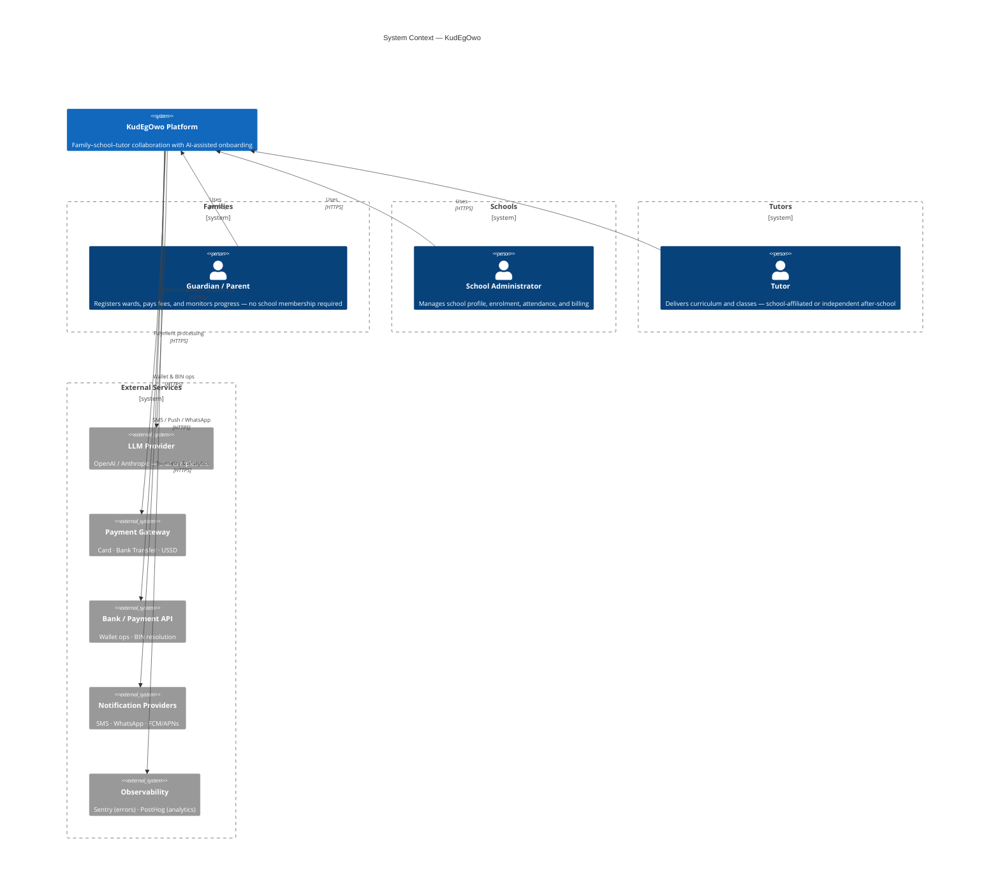
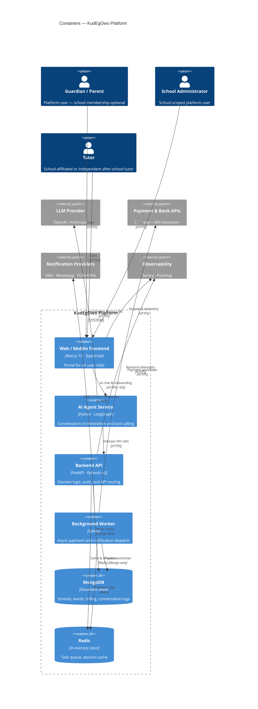
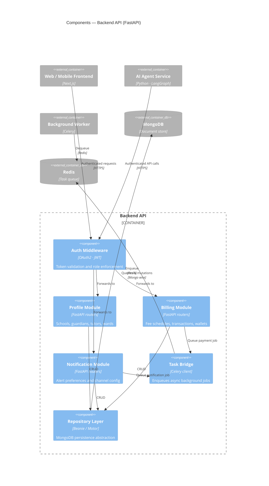
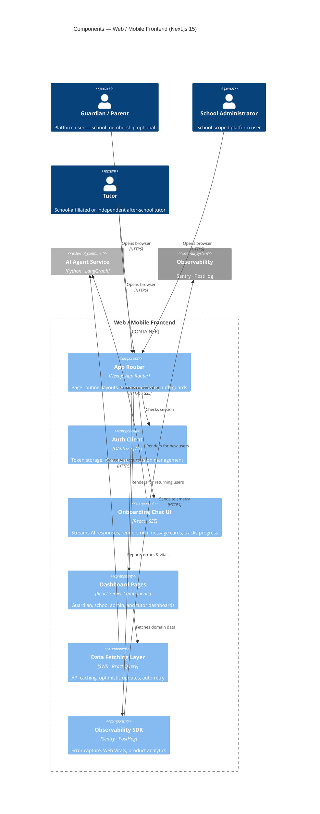
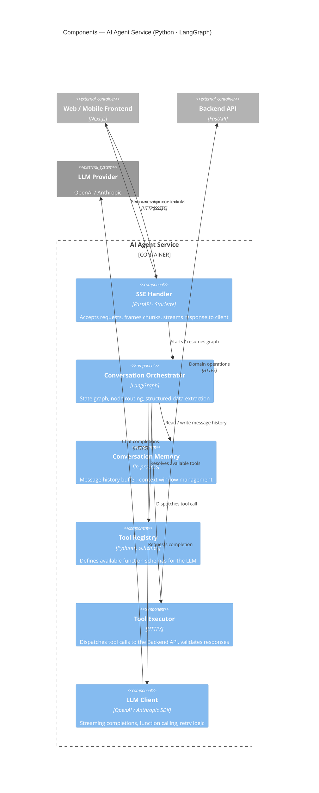
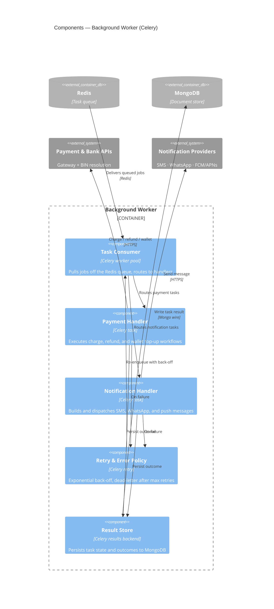
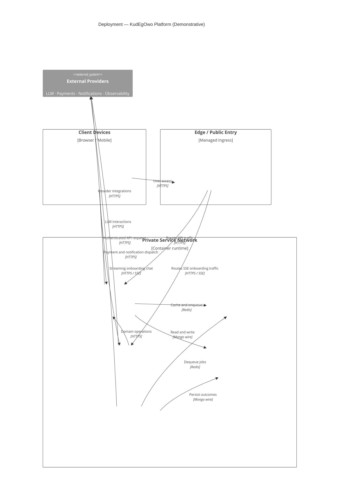

# KudEgOwo — Architecture Document

| Field | Value |
|---|---|
| **Status** | Draft |
| **Version** | 0.1 |
| **Last Updated** | March 2026 |
| **Authors** | Platform Team |
| **Reviewers** | TBD |

---

## Purpose

This document describes the software architecture of the **KudEgOwo** platform using the [C4 model](https://c4model.com/abstractions). It is intended as the primary reference for engineers, product stakeholders, and technical reviewers to understand system structure, responsibilities, and integration boundaries.

## Scope

The diagrams cover the full KudEgOwo platform — from the high-level system context down to individual components within each container. External systems (LLM provider, payment gateway, notification services, observability) are identified at the boundary but are not decomposed further in this document.

## Audience

- **Engineers** — understand component responsibilities and integration contracts
- **Product / Stakeholders** — understand system boundaries and external dependencies
- **Security reviewers** — identify trust boundaries and data flows across system edges

---

## Diagrams

Diagrams follow the C4 abstractions from https://c4model.com/abstractions:
1. System Context
2. Container
3. Component — Backend API (FastAPI)
4. Component — Web / Mobile Frontend (Next.js 15)
5. Component — AI Agent Service (Python · LangGraph)
6. Component — Background Worker (Celery)

---

## 1) System Context (C4Context)

### Notes

- The KudEgOwo platform serves three distinct user personas: **Guardians/Parents**, **School Administrators**, and **Tutors**. A guardian does not need to belong to a school — independent after-school tutor relationships are a first-class use case.
- All external services are treated as untrusted systems crossing a security boundary. Credentials and API keys for LLM, payment, and notification providers must never be exposed to the frontend.
- The **Payment Gateway** and **Bank/Payment API** are separated because BIN resolution and wallet operations may use a different provider than the card-processing gateway.
- Observability (Sentry + PostHog) is a platform-wide concern with both frontend and backend instrumentation.

---

## 2) Container (C4Container)

### Notes

- The **Backend API** (FastAPI) is the single authoritative domain service. The AI Agent Service does not write directly to MongoDB — all mutations flow through the Backend API to enforce business rules and access control.
- The **AI Agent Service** is deployed as a separate process to allow independent scaling during high-concurrency onboarding sessions and to isolate LLM API latency from synchronous request paths.
- **Redis** serves a dual purpose: Celery task broker (background jobs) and application-level cache (session state, rate-limit counters). These two namespaces must be kept logically isolated.
- The **Background Worker** (Celery) handles all operations that are either long-running or require retry semantics — payment charges, refunds, and multi-channel notification dispatch.
- The frontend communicates with the AI Agent Service over **Server-Sent Events (SSE)** to stream partial LLM responses, reducing perceived latency on onboarding flows.

---

## 3) Component — Backend API (C4Component)

Zooms into the **Backend API** container (FastAPI · Pydantic v2).

### Notes

- **Auth Middleware** is the only entry point for all domain modules. Every inbound request — whether from the frontend or the AI Agent Service — must carry a valid JWT. Role claims in the token determine which resources are accessible.
- The **Repository Layer** (Beanie/Motor) is the sole location that holds MongoDB connection logic. No other component issues raw database queries, keeping persistence concerns centralised and testable.
- The **Task Bridge** is a thin Celery client wrapper. It only enqueues jobs; it never executes business logic itself. This prevents accidental synchronous execution of long-running work inside an API request.
- The **Notification Module** stores alert preferences and channel configuration but delegates actual dispatch to the Background Worker via the Task Bridge — it never calls notification providers directly.
- The **Billing Module** follows the same pattern: fee schedules and transaction records are managed here, but payment execution is offloaded to the worker.

---

## 4) Component — Web / Mobile Frontend (C4Component)

Zooms into the **Web / Mobile Frontend** container (Next.js 15 · TypeScript).

### Notes

- **App Router** uses Next.js 15 edge middleware as the outermost auth guard. Routes requiring authentication are protected before any React Server Component renders, avoiding flashes of unauthenticated content.
- **Auth Client** stores tokens in `HttpOnly` cookies (not `localStorage`) to prevent XSS-based token theft. Silent refresh is managed through a dedicated API route rather than in-browser timers.
- **Onboarding Chat UI** is the primary AI touchpoint. It connects directly to the AI Agent Service over SSE, not through the Backend API, to keep streaming latency low. The UI renders rich message cards (school cards, fee cards) from structured JSON payloads embedded in SSE events.
- **Dashboard Pages** use React Server Components where possible to minimise client-side JavaScript. Interactive islands (forms, real-time tables) hydrate selectively.
- **Data Fetching Layer** (SWR / React Query) handles cache invalidation and optimistic updates for guardian, admin, and tutor dashboards. It targets the Backend API exclusively — not the AI Agent Service.
- The **Observability SDK** captures Web Vitals, unhandled errors, and product-analytics events. PII must be scrubbed from analytics payloads before they leave the browser.

---

## 5) Component — AI Agent Service (C4Component)

Zooms into the **AI Agent Service** container (Python · LangGraph).

### Notes

- The **Conversation Orchestrator** (LangGraph) defines the onboarding flow as a directed state graph. Each node represents a stage (e.g., collect school details, confirm ward enrolment, initiate payment). This makes flow logic explicit and testable without mocking the LLM.
- **Conversation Memory** is currently in-process (message history buffer). For multi-instance deployments this must be externalised to Redis or MongoDB to avoid session affinity requirements.
- The **Tool Registry** declares function schemas that are injected into the LLM system prompt. The LLM never has direct access to databases or APIs — it can only request tool calls, which the **Tool Executor** then validates and dispatches.
- The **Tool Executor** calls the Backend API over authenticated HTTPS (service-to-service JWT). This ensures all domain mutations go through the same auth and validation layer used by human users.
- The **LLM Client** wraps the OpenAI/Anthropic SDK with retry logic and streaming support. Provider selection (OpenAI vs. Anthropic) should be configurable via environment variable to avoid vendor lock-in.
- The **SSE Handler** frames LangGraph streaming events into the SSE protocol. It is responsible for keeping the connection alive and signalling completion or error states to the frontend.

---

## 6) Component — Background Worker (C4Component)

Zooms into the **Background Worker** container (Celery).

### Notes

- The **Task Consumer** is the only component that reads from the Redis queue. It routes tasks by task type to the appropriate handler, keeping routing logic separate from business logic.
- **Payment Handler** and **Notification Handler** are isolated Celery tasks. Failure in one does not affect the other — each has its own retry chain and dead-letter path via the **Retry & Error Policy**.
- The **Retry & Error Policy** uses exponential back-off with a configurable maximum retry count. Tasks that exhaust retries are moved to a dead-letter queue and must trigger an alert for manual review — silent failure is not acceptable for financial operations.
- The **Result Store** (Celery results backend) writes task state and outcomes to MongoDB. This provides an audit trail for every payment and notification dispatch, which is critical for support and reconciliation workflows.
- The worker must **not** expose any HTTP endpoints. All communication is inbound from Redis and outbound to external APIs (payments, notifications) and MongoDB.

<!-- [MermaidChart: 6813661e-96bc-4098-abaa-ef15ba0e549d] -->

---

## Deployment Architecture[^deployment-note]

### Notes

- **Web / Mobile Frontend (Next.js 15)** is deployed on an edge-capable hosting platform to support middleware execution and low-latency global access.
- **Backend API (FastAPI)**, **AI Agent Service (LangGraph)**, and **Background Worker (Celery)** run as separate containerized services to allow independent scaling and fault isolation.
- **Redis** and **MongoDB** are deployed as managed stateful services inside a private network segment; only internal services can access them directly.
- Public traffic enters through a managed HTTPS ingress / load balancer that routes frontend and API traffic, while worker traffic remains private.
- Outbound access to third-party providers (LLM, payments, notifications, observability) is restricted to required egress paths from backend services.

---

## Cross-Cutting Concerns

| Concern | Approach |
|---|---|
| **Authentication** | OAuth2 / JWT issued by the Backend API; validated by Auth Middleware on every request. Service-to-service calls (AI Agent → Backend API) use a dedicated service JWT. |
| **Authorisation** | Role-based access control (RBAC) enforced at the API layer. Roles: `guardian`, `school_admin`, `tutor`, `service`. |
| **Secrets management** | All API keys and credentials sourced from environment variables / secrets manager. Never committed to source control or logged. |
| **PII handling** | Personal data (names, contact details, ward records) stored in MongoDB with field-level consideration for encryption at rest. PII must be scrubbed from observability payloads. |
| **Observability** | Distributed tracing via Sentry (errors + performance) and PostHog (product analytics). Each service propagates trace context via HTTP headers. |
| **Resilience** | Background Worker uses exponential back-off and dead-letter queues. LLM Client includes retry logic with provider fallback capability. |
| **Scalability** | AI Agent Service and Background Worker scale independently. Redis and MongoDB are the shared stateful resources; horizontal scaling relies on their respective clustering models. |

---

## Open Questions / Decisions Pending

- [ ] **Conversation Memory externalisation** — in-process memory in the AI Agent Service must be migrated to Redis or MongoDB before multi-instance deployment.
- [ ] **LLM provider strategy** — confirm whether OpenAI and Anthropic are both required simultaneously (routing / fallback) or whether one is the primary with the other as a failover.
- [ ] **Frontend deployment target** — confirm whether Next.js runs on Vercel, a self-hosted Node server, or as a static export. This affects edge middleware availability and SSE connection handling.
- [ ] **Dead-letter queue alerting** — define ownership and SLA for responding to payment tasks that exhaust retries.
- [ ] **Database access control** — confirm whether the AI Agent Service ever needs direct MongoDB read access (e.g., for conversation log retrieval) or whether all reads go through the Backend API.

---

[^deployment-note]: The deployment architecture in this document is for demonstrative purposes only.

_Last updated: March 2026_
<!-- [MermaidChart: 5251dfeb-8ff3-4108-a62b-6165bd665963] -->
