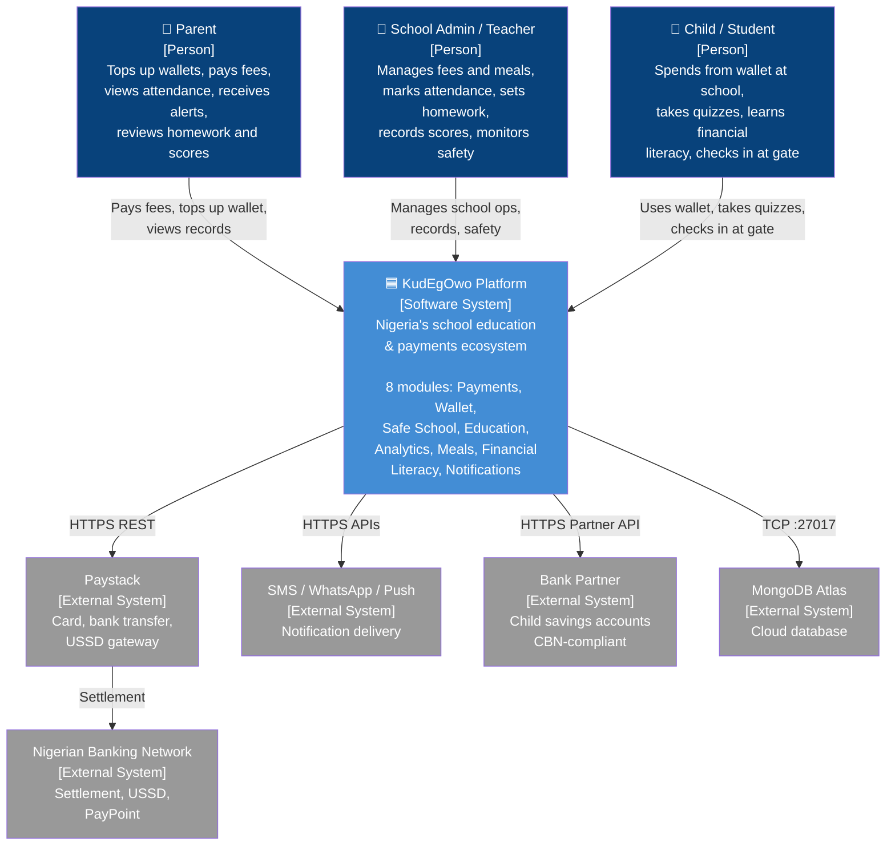
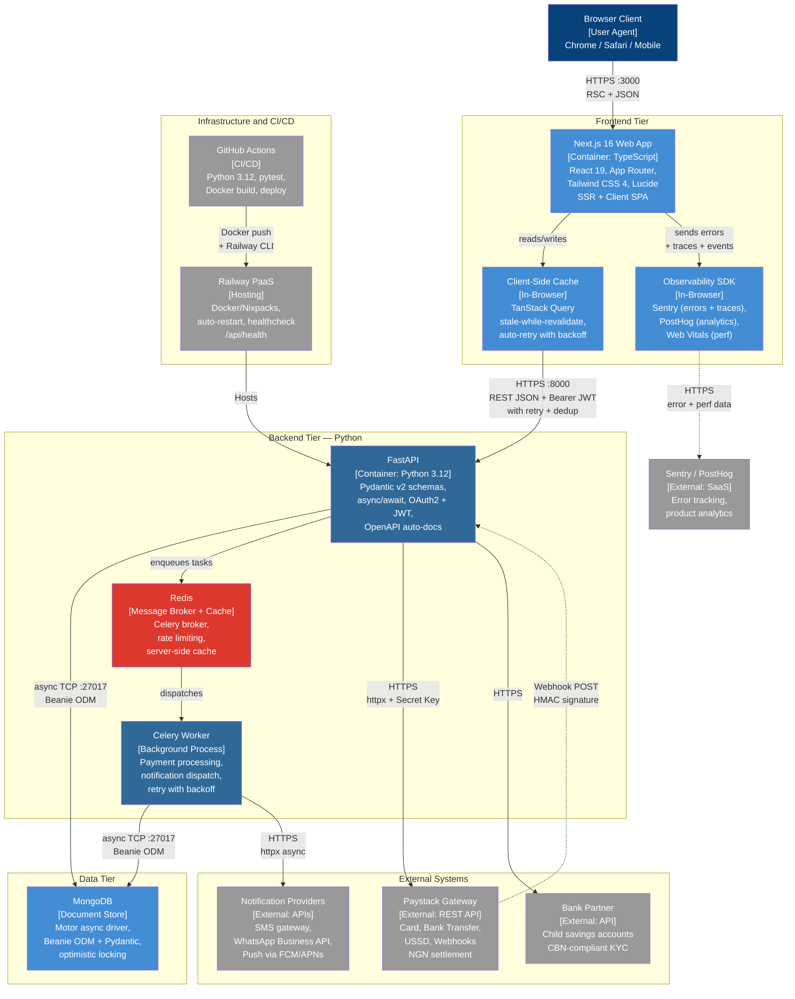

# KudEgOwo — C4 Architecture Diagrams

## Level 1: System Context Diagram

> Who uses KudEgOwo and what external systems does it depend on?

---

## Level 2: Container Diagram (Technical)

> What are the actual technical building blocks and how do they communicate?

---

## Container Inventory

### Frontend Tier

| Container | Tech Stack | Purpose |
|-----------|-----------|---------|
| **Next.js 16 Web App** | React 19, TypeScript, Tailwind CSS 4, App Router, Lucide | SSR + SPA. Dashboard, pitch decks ×4, wireframes ×7, school management UI |

### Backend Tier

| Container | Tech Stack | Purpose |
|-----------|-----------|---------|
| **NestJS 11 API** | TypeScript, Passport JWT (15min access / 7d refresh), class-validator, Mongoose 8, `@nestjs/schedule` | Primary API. Modules: Auth, Users, SchoolProfiles, Children, ScheduledPayments, Notifications |
| **Express 5 API** | JavaScript, JWT, express-validator, Mongoose 9, node-cron, express-rate-limit | Legacy API. Routes: auth, users, payments, items, school-profiles, children, fee-categories, scheduled-payments |
| **Payment Scheduler** | In-process cron (not a separate worker) | Processes due payments every 15min. Recovers stale locks every 60min. Exponential backoff retry. Atomic optimistic locking via `findOneAndUpdate`. |

### Data Tier

| Container | Tech Stack | Purpose |
|-----------|-----------|---------|
| **MongoDB** | Document store, Mongoose ODM | Collections: Users, SchoolProfiles, Children, FeeCategories, ScheduledPayments, Notifications, PaymentItems, Transactions |

### External Systems

| System | Protocol | Purpose |
|--------|----------|---------|
| **Paystack** | HTTPS REST + `sk_***`, Webhooks | Payment processing — card, bank transfer, USSD. NGN settlement. |
| **Notification Providers** | HTTPS APIs | SMS, WhatsApp Business API, Push (FCM/APNs). Prototyped, not yet integrated. |
| **Bank Partner** | HTTPS Partner API | Child savings accounts with CBN-compliant KYC. Referenced in pitch. |

### Infrastructure

| System | Tech | Purpose |
|--------|------|---------|
| **Railway PaaS** | Nixpacks builder, healthcheck, auto-restart (max 10 retries) | Hosts Express backend. Scale: 1 instance. |
| **GitHub Actions** | Node 18, `npm ci`, `railway-action@v1` | CI/CD. Triggers on push to `main` when `backend/**` changes. |

---

## Communication Protocols

| From | To | Protocol | Auth |
|------|----|----------|------|
| Browser | Next.js | HTTPS `:3000` | Session/cookie |
| Next.js | NestJS / Express | HTTPS `:5000` | `Authorization: Bearer <JWT>` |
| NestJS / Express | MongoDB | TCP `:27017` | Connection string credentials |
| Scheduler | MongoDB | TCP `:27017` | Atomic `findOneAndUpdate` |
| API | Paystack | HTTPS | `Authorization: Bearer sk_***` |
| Paystack | API | HTTPS Webhook POST | Signature verification |
| GitHub Actions | Railway | Railway CLI | `RAILWAY_API_TOKEN` secret |

---

## Key Technical Decisions

1. **Dual backend** — NestJS (new, typed, modular) coexists with Express (legacy, currently deployed). Migration in progress.
2. **JWT auth** — 15min access token (`expiresIn: 900`), 7d refresh token. Passport strategy with `JwtAuthGuard`.
3. **Scheduler is in-process** — Not a separate worker/queue. Runs as cron inside the API process. Safe for single-instance via optimistic locking.
4. **No message queue** — Payments, notifications, and scheduling are synchronous or cron-driven. No Redis/RabbitMQ/SQS yet.
5. **No CDN/edge** — Next.js serves static assets directly. No CloudFront/Vercel Edge layer.
6. **Monorepo** — Frontend + two backends + docs in one Git repository.

---

## What's Not Built Yet (from prototypes)

| Capability | Status | Technical Implication |
|-----------|--------|----------------------|
| Safe School (gate access, attendance) | Wireframed | Needs IoT/device integration, real-time WebSocket |
| Education Platform (homework, scores) | Wireframed | Needs offline-first sync, possibly SQLite + sync layer |
| Financial Literacy (gamification) | Wireframed | Needs game state management, leaderboard service |
| Smart Meal Management | Wireframed | Needs canteen POS integration, menu CRUD |
| Notification delivery | Prototyped in code | Needs SMS/WhatsApp/FCM provider integration |
| Bank Partner integration | Referenced in pitch | Needs KYC flow, partner API contract |
| Mobile app | Mobile-first CSS only | No native app — future React Native or PWA |
