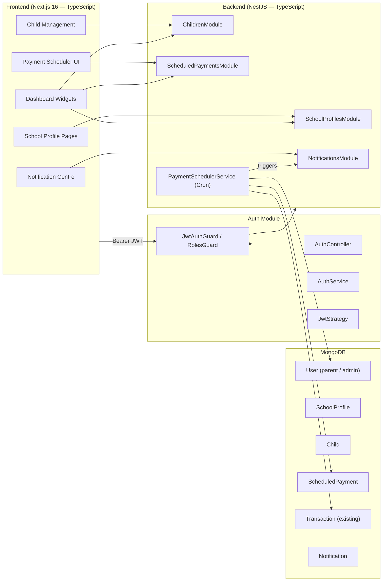
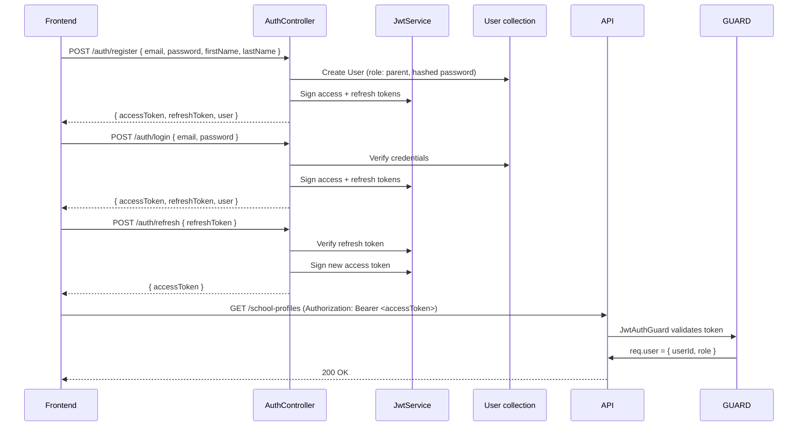
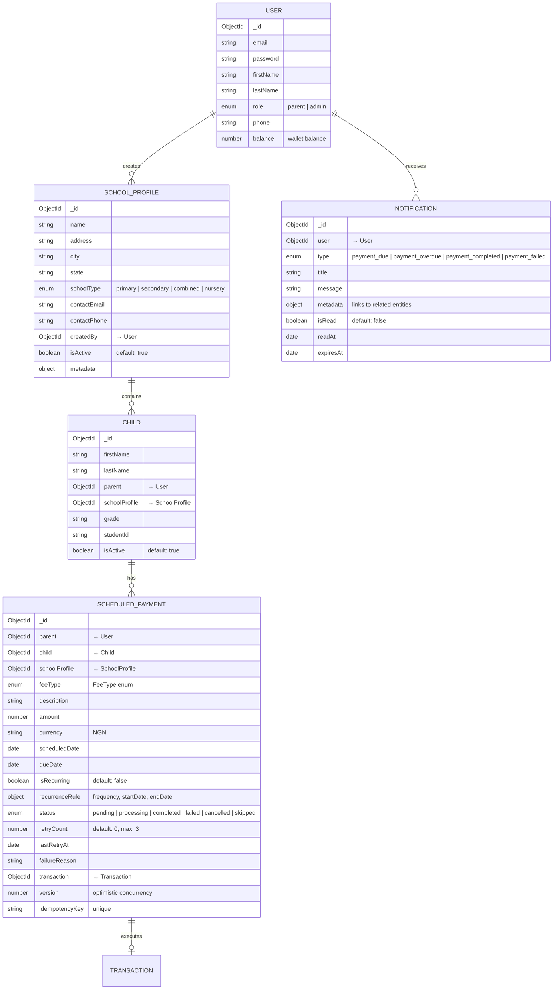
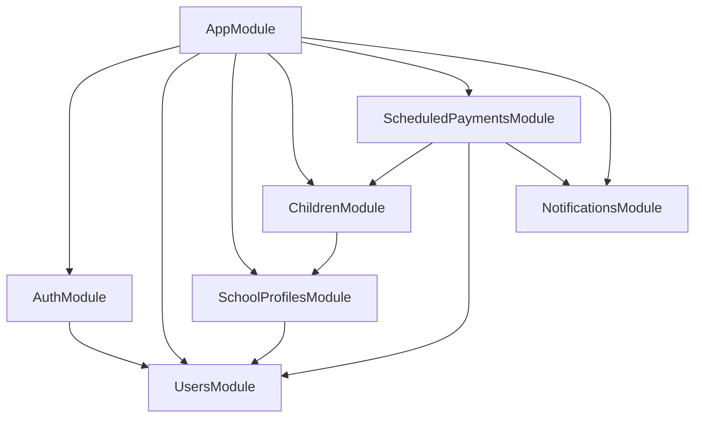
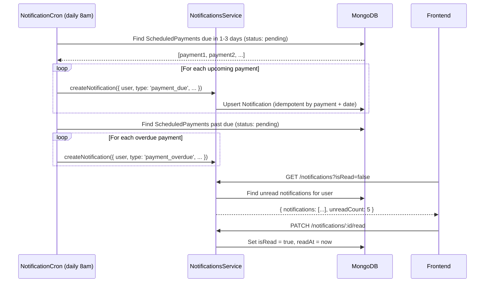
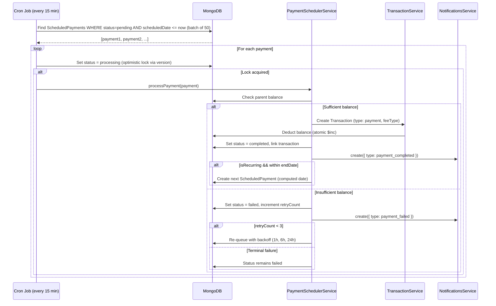

# Design: Independent School Wallet Setup (Revised)

## System Architecture

### High-Level Overview

The backend is built with **NestJS** (OOP, TypeScript, decorator-driven) using standalone, reusable modules. The frontend is **Next.js 16** with strongly typed TypeScript. Authentication flows through a dedicated **Auth module** with JWT access/refresh tokens and role-based guards. A **Notification module** handles upcoming payment alerts.



### Design Principles

1. **OOP & NestJS modules** — Each domain is a standalone NestJS module (controller + service + schema + DTOs). Modules are self-contained and import only what they need.
2. **Strongly typed TypeScript** — All DTOs use `class-validator` / `class-transformer`. Mongoose schemas use `@nestjs/mongoose` decorators with typed documents. No `any` types.
3. **User IS the Parent** — There is **no separate Parent table**. The existing `User` schema with `role: 'parent' | 'admin'` serves as both the auth entity and the parent entity. The `@Roles('parent')` guard restricts parent-only endpoints.
4. **FeeType is an enum, not an endpoint** — Fee categories (`tuition`, `meals`, `transport`, etc.) are a **TypeScript enum** (`FeeType`), used as a field on `ScheduledPayment`. No `FeeCategory` collection or CRUD endpoint exists. Fee details (amount, description, due date, recurrence) live directly on `ScheduledPayment`.
5. **Intent vs. Execution** — `ScheduledPayment` is a payment *intent*; `Transaction` is the *execution*. This decoupling enables retry, skip, and cancel semantics.
6. **Idempotent operations** — Scheduled payment processing uses idempotency keys to prevent double-execution.
7. **Notification-driven** — Upcoming/overdue payments trigger `Notification` documents surfaced on the frontend.

---

## Authentication Design

### Auth Flow



### Token Strategy

| Token | Lifetime | Storage | Purpose |
|-------|----------|---------|---------|
| Access Token (JWT) | 15 min | Memory / httpOnly cookie | Authenticates API requests |
| Refresh Token (JWT) | 7 days | httpOnly cookie | Obtains new access tokens silently |

### Guards & Decorators (NestJS)

```typescript
// @/common/guards/jwt-auth.guard.ts
@Injectable()
export class JwtAuthGuard extends AuthGuard('jwt') {}

// @/common/guards/roles.guard.ts
@Injectable()
export class RolesGuard implements CanActivate {
  canActivate(context: ExecutionContext): boolean {
    const requiredRoles = this.reflector.get<UserRole[]>('roles', context.getHandler());
    const { user } = context.switchToHttp().getRequest();
    return requiredRoles.includes(user.role);
  }
}

// Usage in controllers:
@UseGuards(JwtAuthGuard, RolesGuard)
@Roles(UserRole.PARENT)
@Get()
async findAll(@CurrentUser() user: UserDocument) { ... }
```

---

## User / Parent Model

There is **no separate Parent table**. The `User` document doubles as the parent entity.

```typescript
// user.schema.ts
export enum UserRole {
  PARENT = 'parent',
  ADMIN = 'admin',
}

@Schema({ timestamps: true })
export class User {
  @Prop({ required: true })
  email: string;

  @Prop({ required: true })
  password: string;  // bcrypt hash

  @Prop({ required: true })
  firstName: string;

  @Prop({ required: true })
  lastName: string;

  @Prop({ type: String, enum: UserRole, default: UserRole.PARENT })
  role: UserRole;

  @Prop()
  phone?: string;

  @Prop({ default: 0 })
  balance: number;  // wallet balance in kobo (NGN)
}
```

The `createdBy` / `parent` fields on all child documents reference `User._id`. Queries are always scoped: `{ parent: user._id }`.

---

## Data Model

### FeeType Enum (NOT an endpoint)

Fee categories are a **TypeScript enum**, not a MongoDB collection:

```typescript
// @/common/enums/fee-type.enum.ts
export enum FeeType {
  TUITION = 'tuition',
  MEALS = 'meals',
  TRANSPORT = 'transport',
  UNIFORM = 'uniform',
  BOOKS = 'books',
  TRIPS = 'trips',
  EXTRACURRICULAR = 'extracurricular',
  OTHER = 'other',
}
```

This enum is used as a field on `ScheduledPayment` and `Transaction`. There is no CRUD for fee types — they are compile-time constants.

### Entity Relationship Diagram



### Index Strategy

| Collection | Index | Type | Purpose |
|-----------|-------|------|---------|
| User | `{ email: 1 }` | unique | Login lookup |
| SchoolProfile | `{ createdBy: 1, name: 1 }` | unique compound | Prevent duplicate school names per parent |
| Child | `{ parent: 1, schoolProfile: 1 }` | compound | List children per school |
| Child | `{ parent: 1, firstName: 1, lastName: 1, schoolProfile: 1 }` | unique compound | Prevent duplicate children |
| ScheduledPayment | `{ status: 1, scheduledDate: 1 }` | compound | Cron job: find due payments |
| ScheduledPayment | `{ parent: 1, status: 1 }` | compound | Parent's pending payments |
| ScheduledPayment | `{ idempotencyKey: 1 }` | unique sparse | Prevent duplicate transactions |
| Notification | `{ user: 1, isRead: 1, createdAt: -1 }` | compound | Unread notifications query |
| Notification | `{ expiresAt: 1 }` | TTL | Auto-delete expired notifications |

---

## NestJS Module Architecture

Each module is **standalone and reusable**. Modules only import what they explicitly depend on.

```
backend-nestjs/
├── src/
│   ├── main.ts                          # Bootstrap
│   ├── app.module.ts                    # Root module
│   │
│   ├── common/                          # Shared (no module)
│   │   ├── enums/
│   │   │   ├── fee-type.enum.ts         # FeeType enum
│   │   │   ├── school-type.enum.ts      # SchoolType enum
│   │   │   ├── payment-status.enum.ts   # PaymentStatus enum
│   │   │   └── user-role.enum.ts        # UserRole enum
│   │   ├── decorators/
│   │   │   ├── current-user.decorator.ts
│   │   │   └── roles.decorator.ts
│   │   ├── guards/
│   │   │   ├── jwt-auth.guard.ts
│   │   │   └── roles.guard.ts
│   │   ├── filters/
│   │   │   └── all-exceptions.filter.ts
│   │   ├── pipes/
│   │   │   └── mongo-id-validation.pipe.ts
│   │   └── interfaces/
│   │       └── paginated-response.interface.ts
│   │
│   ├── auth/                            # AuthModule (standalone)
│   │   ├── auth.module.ts
│   │   ├── auth.controller.ts
│   │   ├── auth.service.ts
│   │   ├── strategies/jwt.strategy.ts
│   │   └── dto/
│   │       ├── register.dto.ts
│   │       └── login.dto.ts
│   │
│   ├── users/                           # UsersModule (standalone)
│   │   ├── users.module.ts
│   │   ├── users.service.ts
│   │   ├── users.controller.ts
│   │   ├── schemas/user.schema.ts
│   │   └── dto/update-user.dto.ts
│   │
│   ├── school-profiles/                 # SchoolProfilesModule (standalone)
│   │   ├── school-profiles.module.ts
│   │   ├── school-profiles.controller.ts
│   │   ├── school-profiles.service.ts
│   │   ├── schemas/school-profile.schema.ts
│   │   └── dto/
│   │       ├── create-school-profile.dto.ts
│   │       └── update-school-profile.dto.ts
│   │
│   ├── children/                        # ChildrenModule (standalone)
│   │   ├── children.module.ts
│   │   ├── children.controller.ts
│   │   ├── children.service.ts
│   │   ├── schemas/child.schema.ts
│   │   └── dto/
│   │       ├── create-child.dto.ts
│   │       └── update-child.dto.ts
│   │
│   ├── scheduled-payments/              # ScheduledPaymentsModule (standalone)
│   │   ├── scheduled-payments.module.ts
│   │   ├── scheduled-payments.controller.ts
│   │   ├── scheduled-payments.service.ts
│   │   ├── scheduler/
│   │   │   └── payment-scheduler.service.ts
│   │   ├── schemas/scheduled-payment.schema.ts
│   │   └── dto/
│   │       ├── create-scheduled-payment.dto.ts
│   │       └── query-scheduled-payment.dto.ts
│   │
│   └── notifications/                   # NotificationsModule (standalone)
│       ├── notifications.module.ts
│       ├── notifications.controller.ts
│       ├── notifications.service.ts
│       ├── schemas/notification.schema.ts
│       └── dto/
│           └── query-notification.dto.ts
│
├── package.json
├── tsconfig.json
├── nest-cli.json
└── .env
```

### Module Dependency Graph



---

## Notification Design

### When Notifications Are Created

| Trigger | NotificationType | Timing |
|---------|-----------------|--------|
| Scheduled payment due in 3 days | `payment_due` | Cron: daily at 8am |
| Scheduled payment due in 1 day | `payment_due` | Cron: daily at 8am |
| Payment is overdue (past scheduledDate) | `payment_overdue` | Cron: daily at 8am |
| Payment completed (auto or manual) | `payment_completed` | Immediately on execution |
| Payment failed (insufficient balance) | `payment_failed` | Immediately on failure |
| Payment permanently failed (3 retries) | `payment_failed` | On terminal failure |

### Notification Flow



### Notification API

| Method | Endpoint | Description |
|--------|----------|-------------|
| GET | `/notifications` | List notifications (paginated, filterable by isRead) |
| GET | `/notifications/unread-count` | Quick badge count |
| PATCH | `/notifications/:id/read` | Mark single as read |
| PATCH | `/notifications/read-all` | Mark all as read |

### Notification Schema (TypeScript)

```typescript
export enum NotificationType {
  PAYMENT_DUE = 'payment_due',
  PAYMENT_OVERDUE = 'payment_overdue',
  PAYMENT_COMPLETED = 'payment_completed',
  PAYMENT_FAILED = 'payment_failed',
}

@Schema({ timestamps: true })
export class Notification {
  @Prop({ type: Types.ObjectId, ref: 'User', required: true, index: true })
  user: Types.ObjectId;

  @Prop({ type: String, enum: NotificationType, required: true })
  type: NotificationType;

  @Prop({ required: true })
  title: string;

  @Prop({ required: true })
  message: string;

  @Prop({ type: Object })
  metadata?: {
    scheduledPaymentId?: string;
    childId?: string;
    schoolProfileId?: string;
    amount?: number;
    feeType?: FeeType;
  };

  @Prop({ default: false })
  isRead: boolean;

  @Prop()
  readAt?: Date;

  @Prop({ type: Date, index: { expires: 0 } })
  expiresAt: Date;  // TTL: auto-delete after 30 days
}
```

---

## API Contracts (NestJS DTOs)

All request/response types use strongly typed TypeScript DTOs with `class-validator`.

### School Profiles — `/school-profiles`

```typescript
// create-school-profile.dto.ts
export class CreateSchoolProfileDto {
  @IsString() @MinLength(2) @MaxLength(100)
  name: string;

  @IsEnum(SchoolType)
  schoolType: SchoolType;

  @IsOptional() @IsString() @MaxLength(200)
  address?: string;

  @IsOptional() @IsString() @MaxLength(50)
  city?: string;

  @IsOptional() @IsString() @MaxLength(50)
  state?: string;

  @IsOptional() @IsEmail()
  contactEmail?: string;

  @IsOptional() @IsString() @Matches(/^\+?[0-9]{10,15}$/)
  contactPhone?: string;
}
```

### Scheduled Payments — `/scheduled-payments`

```typescript
// create-scheduled-payment.dto.ts
export class CreateScheduledPaymentDto {
  @IsMongoId()
  child: string;

  @IsMongoId()
  schoolProfile: string;

  @IsEnum(FeeType)
  feeType: FeeType;

  @IsOptional() @IsString() @MaxLength(200)
  description?: string;

  @IsNumber() @Min(50) @Max(10_000_000)
  amount: number;

  @IsDateString()
  scheduledDate: string;

  @IsOptional() @IsDateString()
  dueDate?: string;

  @IsOptional() @IsBoolean()
  isRecurring?: boolean;

  @IsOptional() @ValidateNested()
  @Type(() => RecurrenceRuleDto)
  recurrenceRule?: RecurrenceRuleDto;
}

export class RecurrenceRuleDto {
  @IsEnum(RecurrenceFrequency)
  frequency: RecurrenceFrequency;

  @IsDateString()
  startDate: string;

  @IsOptional() @IsDateString()
  endDate?: string;
}
```

---

## Scheduled Payment Processing

### Sequence Diagram



### Retry Policy

| Retry # | Backoff Delay | Total Elapsed |
|---------|---------------|---------------|
| 1 | 1 hour | 1 hour |
| 2 | 6 hours | 7 hours |
| 3 | 24 hours | 31 hours |
| Terminal | — | Payment marked as permanently failed |

### Recurrence Calculation

```typescript
export enum RecurrenceFrequency {
  WEEKLY = 'weekly',
  BIWEEKLY = 'biweekly',
  MONTHLY = 'monthly',
  TERMLY = 'termly',
  ANNUALLY = 'annually',
}
```

- **weekly**: +7 days
- **biweekly**: +14 days
- **monthly**: same day next month (clamped to last day if needed)
- **termly**: +4 months (Nigerian school terms)
- **annually**: +12 months

---

## Security Design

### Data Isolation

Every service method receives the authenticated `User` and scopes queries:

```typescript
// school-profiles.service.ts
async findAll(userId: string, query: QuerySchoolProfileDto): Promise<PaginatedResponse<SchoolProfile>> {
  return this.schoolProfileModel.find({ createdBy: userId, isActive: true })
    .skip((query.page - 1) * query.limit)
    .limit(query.limit)
    .exec();
}
```

### Input Validation

All DTOs use `class-validator` decorators. The global `ValidationPipe` auto-validates:

```typescript
// main.ts
app.useGlobalPipes(new ValidationPipe({
  whitelist: true,          // Strip unknown properties
  forbidNonWhitelisted: true, // Throw on unknown properties
  transform: true,          // Auto-transform types
}));
```

### Resource Limits (per parent)

| Resource | Limit | Rationale |
|----------|-------|-----------|
| School profiles | 10 | Most parents have 1-3 schools |
| Children per school | 20 | Generous for large families |
| Scheduled payments (pending) | 100 | Prevents runaway scheduling |

### Concurrency Control

Optimistic locking on `ScheduledPayment.version`:

```typescript
const result = await this.scheduledPaymentModel.findOneAndUpdate(
  { _id: paymentId, status: PaymentStatus.PENDING, version: currentVersion },
  { $set: { status: PaymentStatus.PROCESSING }, $inc: { version: 1 } },
  { new: true },
);
if (!result) throw new ConflictException('Payment already being processed');
```

---

## Frontend Architecture

### New Pages

| Route | Component | Description |
|-------|-----------|-------------|
| `/dashboard/schools` | SchoolProfileList | List/create school profiles |
| `/dashboard/schools/[id]` | SchoolProfileDetail | School detail with children + payments |
| `/dashboard/scheduled-payments` | ScheduledPaymentList | All scheduled payments across schools |
| `/dashboard/notifications` | NotificationCentre | Notification inbox |

### Dashboard Enhancements
- **Upcoming Obligations Widget**: Next 7 days of due payments
- **Overdue Alerts Banner**: Red banner for past-due payments
- **My Schools Summary Cards**: Quick stats per school
- **Notification Bell**: Unread count badge in sidebar
- **Empty State CTA**: "Add Your First School" if no profiles

### API Client (Strongly Typed)

The frontend API client in `frontend/lib/api.ts` exports strongly typed functions that mirror the NestJS DTOs:

```typescript
export interface CreateScheduledPaymentDto {
  child: string;
  schoolProfile: string;
  feeType: FeeType;
  description?: string;
  amount: number;
  scheduledDate: string;
  dueDate?: string;
  isRecurring?: boolean;
  recurrenceRule?: RecurrenceRuleDto;
}
```

---

## Migration Strategy

### Phase 1: NestJS Backend
1. Scaffold NestJS project in `backend-nestjs/`
2. Implement all modules with TypeScript
3. Run both backends in parallel during transition
4. Migrate frontend API client to new endpoints

### Phase 2: Data Migration
1. Run migration script: extract `User.children[]` → `Child` documents + "Legacy" `SchoolProfile`
2. Keep `User.children[]` populated during transition
3. Deprecate embedded children array
