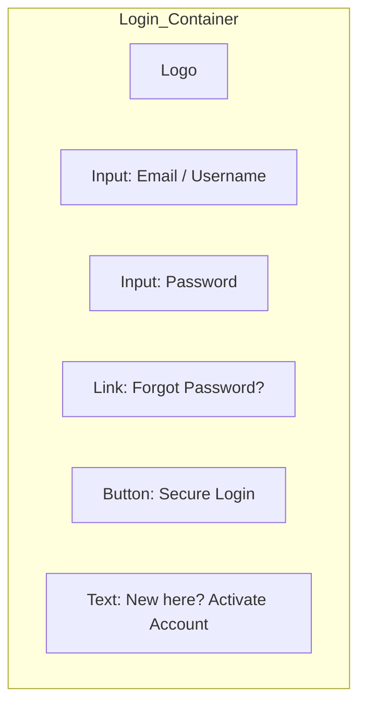
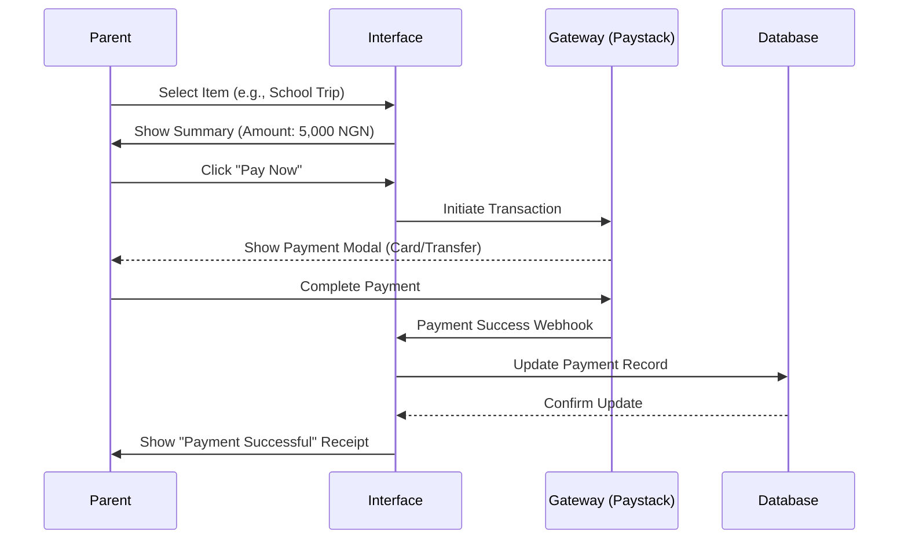
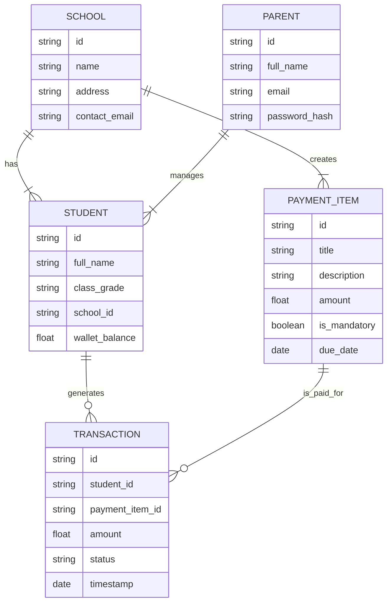

# Design: Naija Eazy Pay

## System Architecture

### High-Level Overview
The system follows a standard 3-tier architecture:
1.  **Client**: Web application (React.js/Next.js) for Parents, Schools, and Admin.
2.  **Server**: RESTful API (Node.js/Express) handling business logic.
3.  **Database**: Relational database (PostgreSQL) for structured data (users, payments, schools).

### Tech Stack
-   **Frontend**: Next.js (React), Tailwind CSS, Lucide React (Icons).
-   **Backend**: Node.js, Express.js.
-   **Database**: PostgreSQL.
-   **Authentication**: JWT-based auth (potential for NextAuth.js).
-   **Payments**: Integration with Nigerian payment gateways (e.g., Paystack/Flutterwave) - *Mocked for design*.

## UI/UX Design

### Color Palette
-   **Primary**: #0056b3 (Deep Blue - Trust, similar to ParentPay)
-   **Secondary**: #28a745 (Green - Growth/Payment, fitting for "Naija")
-   **Accent**: #ffc107 (Yellow/Gold - Highlights)
-   **Background**: #f8f9fa (Light Gray - Clean interface)

### Typography
-   **Headings**: Inter or Poppins (Modern, sans-serif)
-   **Body**: Inter or Roboto (Readable)

## Wireframes

### 1. Landing Page (Public)
Focuses on trust, clarity, and ease of access for parents and schools.

```mermaid
graph TD
    subgraph Header
    A[Logo: Naija Eazy Pay] --> B[Nav: Services | Who We Help | About]
    B --> C[Button: Login]
    end

    subgraph Hero_Section
    D[Headline: Make School Payments Easy & Secure]
    D --> E[Sub: The #1 Cashless System for Nigerian Schools]
    E --> F[CTA: For Parents]
    E --> G[CTA: For Schools]
    end

    subgraph Services_Grid
    H[Card: Cashless Payments]
    I[Card: Meal Manager]
    J[Card: School Trips]
    K[Card: Club Management]
    end

    subgraph Footer
    L[Links: Contact | Support | Privacy]
    end
```

### 2. Login Page
Simple, secure entry point.



### 3. Parent Dashboard (Private)
The central hub for parents to view balances and make payments.

```mermaid
graph TD
    subgraph Sidebar
    A[Home]
    B[Transaction History]
    C[Payment Items]
    D[My Children]
    E[Profile / Settings]
    end

    subgraph Main_Content
    F[Welcome, Parent Name]
    
    subgraph Alerts
    G[Alert: School Trip Payment Due - 5,000 NGN]
    end

    subgraph Child_Overview
    H[Child 1: Chinedu] --> I[Balance: 2,500 NGN]
    I --> J[Button: Add Funds]
    
    K[Child 2: Amara] --> L[Balance: 500 NGN]
    L --> M[Button: Add Funds]
    end

    subgraph Recent_Items
    N[List: Lunch Money | 1,000 NGN | Paid]
    O[List: Science Book | 3,500 NGN | Pending]
    end
    end
```

### 4. Payment Flow
Step-by-step process for adding funds or paying for an item.



## Data Model (Core Entities)


