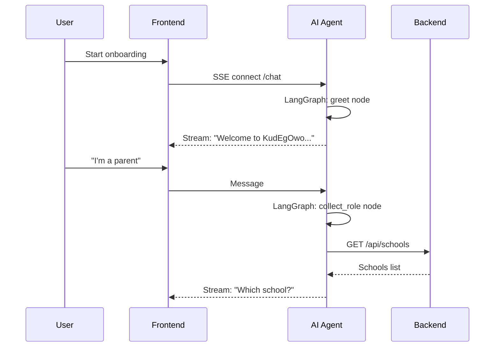
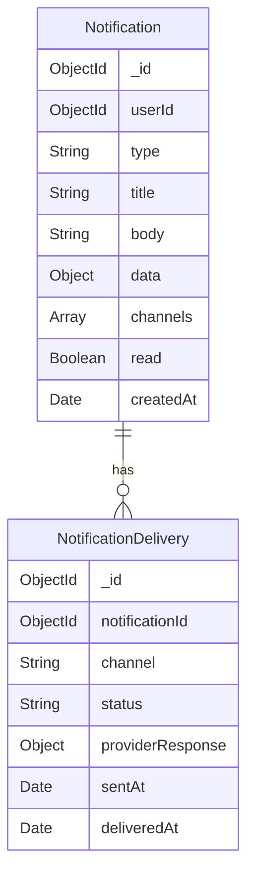
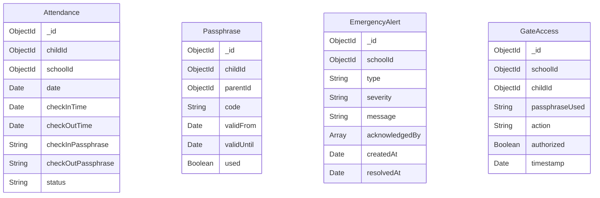
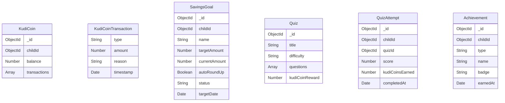
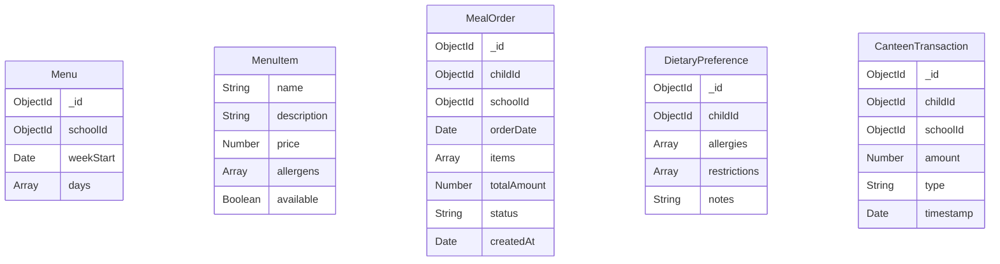

## Context

KudEgOwo is a school payment platform for Nigerian schools with an existing Express.js backend and Next.js frontend. The current implementation has core payment and school wallet features but lacks the integrated demo experience needed for investor presentations. This design covers upgrading to a production-grade demo with AI onboarding, Safe School, Financial Literacy, Meal Management, and proper infrastructure.

**Current State:**
- Express.js backend with MongoDB (users, schools, children, payments)
- Next.js frontend with dashboard, school profiles, scheduled payments
- JWT authentication with role-based access
- Node-cron for scheduled payment processing

**Constraints:**
- Must work with one command: `docker-compose up`
- No real money charged (mock Paystack only)
- No real SMS sent (sandbox/mock only)
- Demo must be resettable to initial state
- 30-minute demo script must be executable

## Goals / Non-Goals

**Goals:**
- One-command startup with Docker Compose
- AI-assisted onboarding via conversational chat
- Complete Safe School module (attendance, gate access, emergency alerts)
- Complete Financial Literacy module (KudiCoins, savings, quizzes)
- Complete Meal Management module (menus, pre-orders, canteen)
- Mock payment integration with test scenarios
- Multi-channel notifications (mock/sandbox)
- Demo controls for presentations
- Observability with Sentry and PostHog

**Non-Goals:**
- Mobile app (React Native) — post-MVP
- Real payment processing — mock only
- Real SMS/WhatsApp delivery — sandbox only
- Bank partner integration — mock only
- Tutor marketplace — post-MVP
- Academic progress tracking — post-MVP

## Decisions

### 1. AI Agent Architecture: FastAPI + LangGraph

**Decision:** Separate Python service for AI agent using FastAPI and LangGraph.

**Rationale:**
- LangGraph provides state machine orchestration for multi-step onboarding
- Python ecosystem has better LLM tooling (langchain, openai, anthropic SDKs)
- Separation allows independent scaling and deployment
- FastAPI provides native async support for SSE streaming

**Alternatives Considered:**
- Node.js with LangChain.js: Less mature, fewer examples
- Embedding in Express: Would complicate the backend, mixing concerns

**Architecture:**


### 2. Background Tasks: Celery + Redis

**Decision:** Replace node-cron with Celery worker and Redis queue.

**Rationale:**
- Celery provides robust task retry, dead-letter queues, and monitoring
- Redis serves dual purpose: task queue and caching
- Flower dashboard for task monitoring
- Better suited for production workloads

**Alternatives Considered:**
- Bull (Node.js): Would keep stack homogeneous but less mature
- Keep node-cron: Not production-grade, no retry logic

**Task Types:**
- `process_payment`: Charge, refund, wallet top-up
- `send_notification`: Multi-channel dispatch
- `process_scheduled_payments`: Replaces cron job
- `generate_daily_report`: School admin reports
- `broadcast_emergency`: Mass notification

### 3. Notification Architecture: Dispatcher Pattern

**Decision:** Central notification dispatcher with pluggable channel handlers.

**Rationale:**
- Single entry point for all notifications
- Easy to add/remove channels
- Channel-specific retry logic
- Template management in one place

**Data Model:**


### 4. Safe School Data Models

**Decision:** Separate models for Attendance, GateAccess, EmergencyAlert, Passphrase.

**Models:**


**Indexes:**
- `Attendance`: `{ childId: 1, date: 1 }` (unique), `{ schoolId: 1, date: 1 }`
- `Passphrase`: `{ code: 1 }` (unique), `{ childId: 1, validUntil: 1 }`
- `EmergencyAlert`: `{ schoolId: 1, createdAt: -1 }`
- `GateAccess`: `{ schoolId: 1, timestamp: -1 }`

### 5. Financial Literacy Data Models

**Models:**


**Indexes:**
- `KudiCoin`: `{ childId: 1 }` (unique)
- `SavingsGoal`: `{ childId: 1, status: 1 }`
- `QuizAttempt`: `{ childId: 1, quizId: 1 }`
- `Achievement`: `{ childId: 1, type: 1 }`

### 6. Meal Management Data Models

**Models:**


**Indexes:**
- `Menu`: `{ schoolId: 1, weekStart: 1 }` (unique)
- `MealOrder`: `{ childId: 1, orderDate: 1 }`, `{ schoolId: 1, orderDate: 1 }`
- `DietaryPreference`: `{ childId: 1 }` (unique)
- `CanteenTransaction`: `{ childId: 1, timestamp: -1 }`

### 7. Docker Compose Architecture

**Services:**
```yaml
services:
  frontend:     # Next.js on :3000
  backend:      # Express.js on :5000
  ai-agent:     # FastAPI on :8000
  worker:       # Celery worker
  redis:        # Redis on :6379
  mongodb:      # MongoDB on :27017 (dev only)
```

**Decision:** MongoDB in compose for development, external MongoDB Atlas for production.

### 8. Mock Paystack Implementation

**Decision:** In-memory mock with configurable test scenarios.

**Test Cards:**
| Card Number | Scenario |
|-------------|----------|
| `4084 0840 8408 4081` | Success |
| `4084 0840 8408 4082` | Insufficient funds |
| `4084 0840 8408 4083` | Declined |

**Webhook Simulation:**
- Configurable delay (0-5 seconds)
- Automatic callback to backend webhook endpoint
- Supports `charge.success`, `charge.failed`, `transfer.success`

## Risks / Trade-offs

| Risk | Mitigation |
|------|------------|
| LLM API costs during demos | Mock LLM mode with pre-scripted responses |
| SMS costs | Termii sandbox or console logging only |
| Complexity of multi-service architecture | Docker Compose abstracts orchestration |
| Time overrun | Each phase is independently demoable |
| AI agent latency | SSE streaming shows progress immediately |
| Redis single point of failure | Acceptable for demo; production would use Redis Cluster |

## Migration Plan

**Deployment Order:**
1. Deploy MongoDB with seed data
2. Deploy Redis
3. Deploy backend with new models/routes
4. Deploy AI agent service
5. Deploy Celery worker
6. Deploy frontend with new pages
7. Configure observability (Sentry, PostHog)

**Rollback Strategy:**
- Each service is independently deployable
- Database migrations are additive (no breaking changes)
- Feature flags for new modules (Safe School, Financial Literacy, Meals)

## Open Questions

1. **LLM Provider:** OpenAI vs Anthropic for AI agent? (Recommend: Support both with adapter pattern)
2. **Passphrase Format:** Numeric PIN vs word-based? (Recommend: 6-digit numeric for simplicity)
3. **KudiCoin Exchange Rate:** How many KudiCoins per Naira? (Recommend: 1 NGN = 10 KudiCoins)
4. **Quiz Content:** Pre-built or admin-created? (Recommend: Pre-built seed data for demo)
