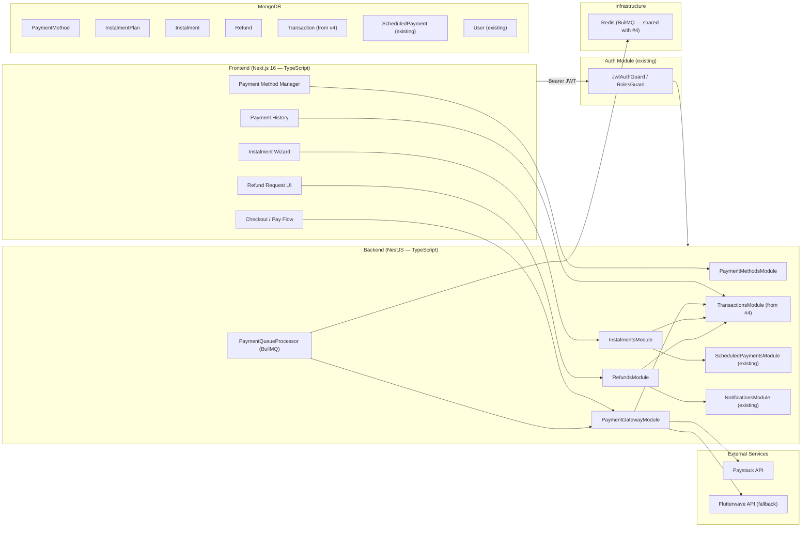
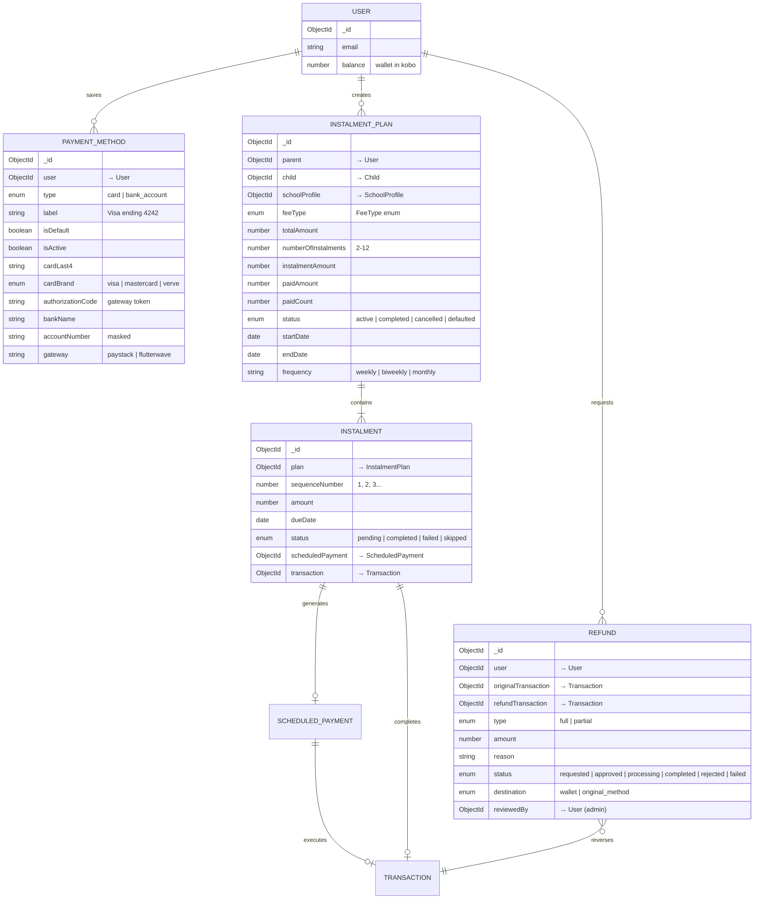
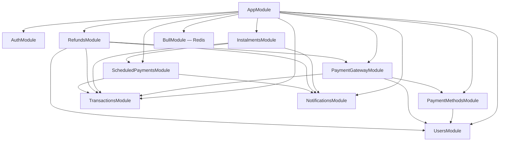
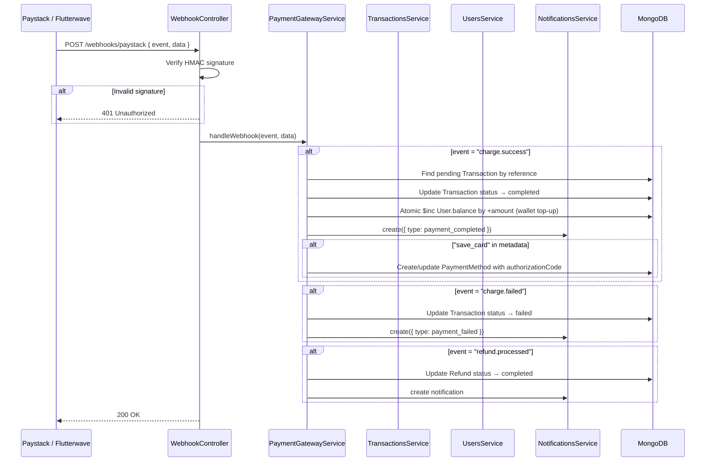
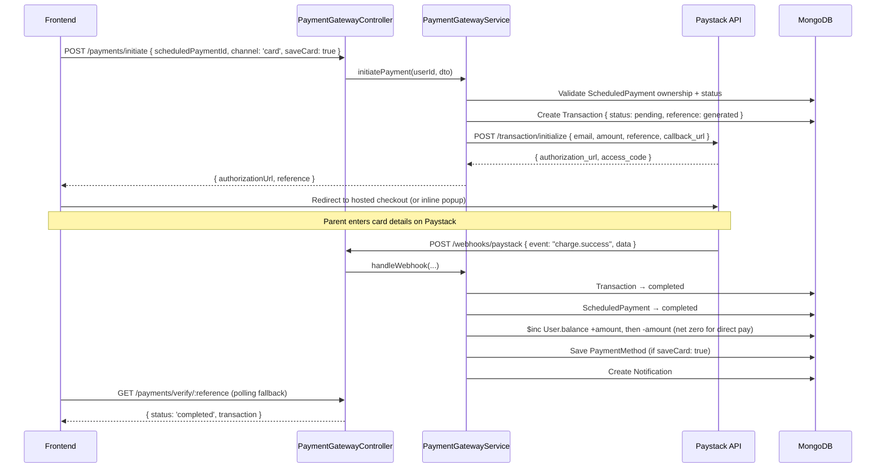
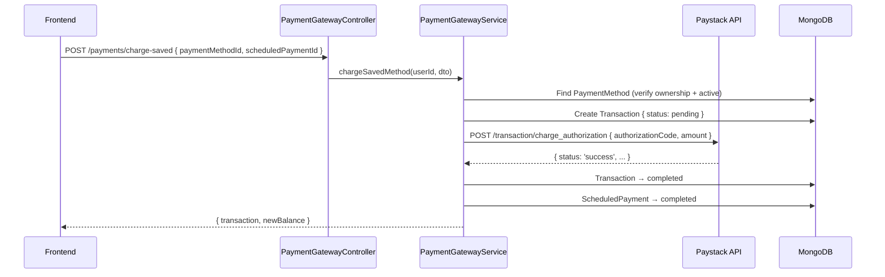
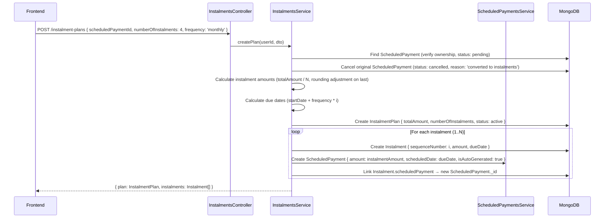
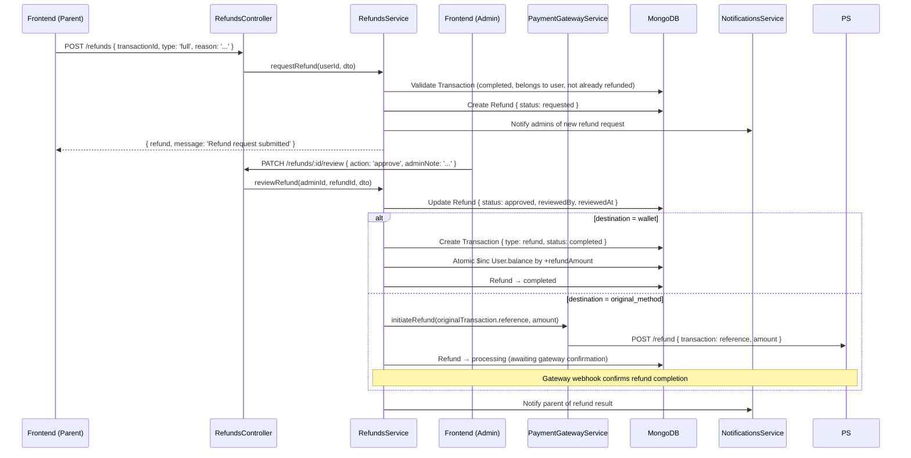

# Design: Multi-Payment Support

## System Architecture

### High-Level Overview

Multi-Payment Support extends Kudegowo with **multiple payment methods** (wallet, card, bank transfer, USSD), **instalment plans**, **partial payments**, **refund workflows**, and **payment reconciliation**. It introduces three new NestJS modules — **PaymentMethodsModule**, **InstalmentsModule**, and **RefundsModule** — plus a **PaymentGatewayModule** that abstracts third-party gateway integrations (Paystack / Flutterwave) behind a unified interface.

The wallet remains the primary funding source. External payment methods (card, bank transfer, USSD) fund the wallet via top-up or pay directly for a scheduled payment. Saved payment methods (tokenized cards, linked bank accounts) are stored securely — Kudegowo **never** stores raw card data; only gateway-issued tokens.



### Design Principles

1. **Gateway abstraction** — A `PaymentGatewayProvider` interface abstracts Paystack and Flutterwave. The active gateway is selected via configuration. Switching gateways requires zero code changes — only an env var change.
2. **Tokenization only** — Kudegowo never sees raw card numbers or CVVs. All card interactions go through the gateway's hosted checkout or inline JS. Only gateway-issued `authorizationCode` / `cardToken` is stored.
3. **Wallet-first** — Even when paying by card/bank, the flow is: charge card → credit wallet → deduct from wallet → create Transaction. This keeps the wallet as the single source of truth for balance and simplifies refund logic.
4. **Instalment as decomposition** — An instalment plan splits a single `ScheduledPayment` into N smaller `Instalment` documents, each with its own due date. Each instalment creates its own `ScheduledPayment` (auto-generated) so the existing cron scheduler processes them automatically.
5. **Refund as reverse transaction** — A refund creates a new `Transaction` of type `refund`, credits the wallet, and optionally triggers a gateway refund for card/bank payments.
6. **Extend, don't break** — Existing `User`, `PaymentItem`, `Transaction` models are not altered. New fields are additive.

---

## Data Models

### PaymentMethod Schema

Stores saved/tokenized payment methods per user.

```typescript
// payment-methods/schemas/payment-method.schema.ts
import { Prop, Schema, SchemaFactory } from '@nestjs/mongoose';
import { HydratedDocument, Types } from 'mongoose';

export type PaymentMethodDocument = HydratedDocument<PaymentMethod>;

export enum PaymentMethodType {
  CARD = 'card',
  BANK_ACCOUNT = 'bank_account',
}

export enum CardBrand {
  VISA = 'visa',
  MASTERCARD = 'mastercard',
  VERVE = 'verve',
}

@Schema({ timestamps: true })
export class PaymentMethod {
  @Prop({ type: Types.ObjectId, ref: 'User', required: true, index: true })
  user: Types.ObjectId;

  @Prop({ type: String, enum: PaymentMethodType, required: true })
  type: PaymentMethodType;

  @Prop({ required: true })
  label: string; // e.g. "Visa ending 4242" or "GTBank ****1234"

  @Prop({ default: false })
  isDefault: boolean;

  @Prop({ default: true })
  isActive: boolean;

  // --- Card-specific fields ---
  @Prop()
  cardLast4?: string;

  @Prop({ type: String, enum: CardBrand })
  cardBrand?: CardBrand;

  @Prop()
  cardExpMonth?: string;

  @Prop()
  cardExpYear?: string;

  @Prop()
  authorizationCode?: string; // Paystack authorization code

  @Prop()
  cardToken?: string; // Flutterwave token

  // --- Bank account fields ---
  @Prop()
  bankName?: string;

  @Prop()
  bankCode?: string;

  @Prop()
  accountNumber?: string; // Last 4 digits only (masked)

  @Prop()
  accountName?: string;

  @Prop()
  recipientCode?: string; // Paystack transfer recipient code

  // --- Gateway metadata ---
  @Prop({ required: true })
  gateway: string; // 'paystack' | 'flutterwave'

  @Prop({ type: Object })
  gatewayMetadata?: Record<string, unknown>;
}

export const PaymentMethodSchema = SchemaFactory.createForClass(PaymentMethod);

PaymentMethodSchema.index({ user: 1, isActive: 1 });
PaymentMethodSchema.index({ user: 1, isDefault: 1 });
PaymentMethodSchema.index({ authorizationCode: 1 }, { sparse: true });
```

### InstalmentPlan Schema

Represents a plan to split a large payment into smaller instalments.

```typescript
// instalments/schemas/instalment-plan.schema.ts
import { Prop, Schema, SchemaFactory } from '@nestjs/mongoose';
import { HydratedDocument, Types } from 'mongoose';
import { FeeType } from '../../common/enums';

export type InstalmentPlanDocument = HydratedDocument<InstalmentPlan>;

export enum InstalmentPlanStatus {
  ACTIVE = 'active',
  COMPLETED = 'completed',
  CANCELLED = 'cancelled',
  DEFAULTED = 'defaulted',
}

@Schema({ timestamps: true })
export class InstalmentPlan {
  @Prop({ type: Types.ObjectId, ref: 'User', required: true, index: true })
  parent: Types.ObjectId;

  @Prop({ type: Types.ObjectId, ref: 'Child', required: true })
  child: Types.ObjectId;

  @Prop({ type: Types.ObjectId, ref: 'SchoolProfile', required: true })
  schoolProfile: Types.ObjectId;

  @Prop({ type: Types.ObjectId, ref: 'ScheduledPayment' })
  originalScheduledPayment?: Types.ObjectId; // The payment being split

  @Prop({ type: String, enum: FeeType, required: true })
  feeType: FeeType;

  @Prop({ trim: true, maxlength: 200 })
  description?: string;

  @Prop({ required: true, min: 100 })
  totalAmount: number; // Total amount in kobo

  @Prop({ default: 'NGN' })
  currency: string;

  @Prop({ required: true, min: 2, max: 12 })
  numberOfInstalments: number;

  @Prop({ required: true, min: 50 })
  instalmentAmount: number; // Per-instalment amount (totalAmount / numberOfInstalments, rounded)

  @Prop({ type: Number, default: 0 })
  paidAmount: number; // Running total of paid instalments

  @Prop({ type: Number, default: 0 })
  paidCount: number; // Number of instalments paid

  @Prop({
    type: String,
    enum: InstalmentPlanStatus,
    default: InstalmentPlanStatus.ACTIVE,
  })
  status: InstalmentPlanStatus;

  @Prop({ type: Date, required: true })
  startDate: Date;

  @Prop({ type: Date, required: true })
  endDate: Date;

  @Prop({ type: String, required: true })
  frequency: string; // 'weekly' | 'biweekly' | 'monthly'
}

export const InstalmentPlanSchema = SchemaFactory.createForClass(InstalmentPlan);

InstalmentPlanSchema.index({ parent: 1, status: 1 });
InstalmentPlanSchema.index({ child: 1, schoolProfile: 1 });
```

### Instalment Schema

Individual instalment within a plan. Each instalment generates a `ScheduledPayment`.

```typescript
// instalments/schemas/instalment.schema.ts
import { Prop, Schema, SchemaFactory } from '@nestjs/mongoose';
import { HydratedDocument, Types } from 'mongoose';
import { PaymentStatus } from '../../common/enums';

export type InstalmentDocument = HydratedDocument<Instalment>;

@Schema({ timestamps: true })
export class Instalment {
  @Prop({ type: Types.ObjectId, ref: 'InstalmentPlan', required: true, index: true })
  plan: Types.ObjectId;

  @Prop({ type: Types.ObjectId, ref: 'User', required: true })
  parent: Types.ObjectId;

  @Prop({ required: true, min: 1 })
  sequenceNumber: number; // 1, 2, 3, ...

  @Prop({ required: true, min: 50 })
  amount: number;

  @Prop({ type: Date, required: true })
  dueDate: Date;

  @Prop({
    type: String,
    enum: PaymentStatus,
    default: PaymentStatus.PENDING,
  })
  status: PaymentStatus;

  @Prop({ type: Types.ObjectId, ref: 'ScheduledPayment' })
  scheduledPayment?: Types.ObjectId; // Auto-generated ScheduledPayment

  @Prop({ type: Types.ObjectId, ref: 'Transaction' })
  transaction?: Types.ObjectId;
}

export const InstalmentSchema = SchemaFactory.createForClass(Instalment);

InstalmentSchema.index({ plan: 1, sequenceNumber: 1 }, { unique: true });
InstalmentSchema.index({ parent: 1, status: 1, dueDate: 1 });
```

### Refund Schema

```typescript
// refunds/schemas/refund.schema.ts
import { Prop, Schema, SchemaFactory } from '@nestjs/mongoose';
import { HydratedDocument, Types } from 'mongoose';

export type RefundDocument = HydratedDocument<Refund>;

export enum RefundStatus {
  REQUESTED = 'requested',
  APPROVED = 'approved',
  PROCESSING = 'processing',
  COMPLETED = 'completed',
  REJECTED = 'rejected',
  FAILED = 'failed',
}

export enum RefundType {
  FULL = 'full',
  PARTIAL = 'partial',
}

export enum RefundDestination {
  WALLET = 'wallet',
  ORIGINAL_METHOD = 'original_method',
}

@Schema({ timestamps: true })
export class Refund {
  @Prop({ type: Types.ObjectId, ref: 'User', required: true, index: true })
  user: Types.ObjectId;

  @Prop({ type: Types.ObjectId, ref: 'Transaction', required: true })
  originalTransaction: Types.ObjectId;

  @Prop({ type: Types.ObjectId, ref: 'Transaction' })
  refundTransaction?: Types.ObjectId; // The reverse Transaction created on approval

  @Prop({ type: String, enum: RefundType, required: true })
  type: RefundType;

  @Prop({ required: true, min: 1 })
  amount: number; // Refund amount in kobo

  @Prop({ default: 'NGN' })
  currency: string;

  @Prop({ required: true, maxlength: 500 })
  reason: string;

  @Prop({
    type: String,
    enum: RefundStatus,
    default: RefundStatus.REQUESTED,
  })
  status: RefundStatus;

  @Prop({
    type: String,
    enum: RefundDestination,
    default: RefundDestination.WALLET,
  })
  destination: RefundDestination;

  @Prop()
  adminNote?: string;

  @Prop({ type: Types.ObjectId, ref: 'User' })
  reviewedBy?: Types.ObjectId; // Admin who approved/rejected

  @Prop()
  reviewedAt?: Date;

  @Prop()
  gatewayRefundId?: string; // If refunded via payment gateway

  @Prop()
  failureReason?: string;
}

export const RefundSchema = SchemaFactory.createForClass(Refund);

RefundSchema.index({ user: 1, status: 1, createdAt: -1 });
RefundSchema.index({ originalTransaction: 1 });
```

### Entity Relationship Diagram



### Index Strategy

| Collection | Index | Type | Purpose |
|-----------|-------|------|---------|
| PaymentMethod | `{ user: 1, isActive: 1 }` | compound | List active methods per user |
| PaymentMethod | `{ user: 1, isDefault: 1 }` | compound | Find default method |
| PaymentMethod | `{ authorizationCode: 1 }` | sparse | Lookup by gateway token |
| InstalmentPlan | `{ parent: 1, status: 1 }` | compound | Parent's active plans |
| InstalmentPlan | `{ child: 1, schoolProfile: 1 }` | compound | Plans per child+school |
| Instalment | `{ plan: 1, sequenceNumber: 1 }` | unique compound | Ordered instalments |
| Instalment | `{ parent: 1, status: 1, dueDate: 1 }` | compound | Upcoming instalments |
| Refund | `{ user: 1, status: 1, createdAt: -1 }` | compound | User's refund history |
| Refund | `{ originalTransaction: 1 }` | single | Find refunds for a transaction |

---

## NestJS Module Architecture

### New Modules

```
backend-nestjs/
├── src/
│   ├── payment-methods/                   # PaymentMethodsModule
│   │   ├── payment-methods.module.ts
│   │   ├── payment-methods.controller.ts
│   │   ├── payment-methods.service.ts
│   │   ├── schemas/payment-method.schema.ts
│   │   └── dto/
│   │       ├── create-payment-method.dto.ts
│   │       └── update-payment-method.dto.ts
│   │
│   ├── payment-gateway/                   # PaymentGatewayModule
│   │   ├── payment-gateway.module.ts
│   │   ├── payment-gateway.service.ts     # Facade — delegates to active provider
│   │   ├── providers/
│   │   │   ├── gateway-provider.interface.ts
│   │   │   ├── paystack.provider.ts
│   │   │   └── flutterwave.provider.ts
│   │   ├── payment-queue.processor.ts     # BullMQ processor for async charges
│   │   ├── webhook.controller.ts          # POST /webhooks/paystack, /webhooks/flutterwave
│   │   └── dto/
│   │       ├── initiate-charge.dto.ts
│   │       └── verify-charge.dto.ts
│   │
│   ├── instalments/                       # InstalmentsModule
│   │   ├── instalments.module.ts
│   │   ├── instalments.controller.ts
│   │   ├── instalments.service.ts
│   │   ├── schemas/
│   │   │   ├── instalment-plan.schema.ts
│   │   │   └── instalment.schema.ts
│   │   └── dto/
│   │       ├── create-instalment-plan.dto.ts
│   │       └── query-instalment.dto.ts
│   │
│   ├── refunds/                           # RefundsModule
│   │   ├── refunds.module.ts
│   │   ├── refunds.controller.ts
│   │   ├── refunds.service.ts
│   │   ├── schemas/refund.schema.ts
│   │   └── dto/
│   │       ├── request-refund.dto.ts
│   │       ├── review-refund.dto.ts
│   │       └── query-refund.dto.ts
│   │
│   ├── common/
│   │   └── enums/
│   │       ├── payment-method-type.enum.ts   # NEW
│   │       ├── refund-status.enum.ts         # NEW
│   │       └── instalment-plan-status.enum.ts # NEW
```

### Module Dependency Graph



---

## Payment Gateway Integration

### Gateway Provider Interface

```typescript
// payment-gateway/providers/gateway-provider.interface.ts
export interface InitiateChargeResult {
  reference: string;
  authorizationUrl?: string; // Redirect URL for hosted checkout
  accessCode?: string;       // For inline popup
  gateway: string;
}

export interface VerifyChargeResult {
  success: boolean;
  reference: string;
  amount: number;
  currency: string;
  channel: string;           // 'card' | 'bank' | 'ussd'
  gatewayResponse: string;
  authorizationCode?: string; // For saving card
  cardLast4?: string;
  cardBrand?: string;
  cardExpMonth?: string;
  cardExpYear?: string;
  bankName?: string;
  metadata?: Record<string, unknown>;
}

export interface GatewayRefundResult {
  success: boolean;
  refundId: string;
  amount: number;
  status: string;
}

export interface PaymentGatewayProvider {
  readonly name: string;

  initiateCharge(params: {
    email: string;
    amount: number;       // in kobo
    currency: string;
    reference: string;
    callbackUrl: string;
    metadata?: Record<string, unknown>;
    authorizationCode?: string; // For recurring card charges
    channels?: string[];        // ['card', 'bank', 'ussd']
  }): Promise<InitiateChargeResult>;

  verifyCharge(reference: string): Promise<VerifyChargeResult>;

  chargeAuthorization(params: {
    email: string;
    amount: number;
    authorizationCode: string;
    reference: string;
  }): Promise<VerifyChargeResult>;

  initiateRefund(params: {
    transactionReference: string;
    amount: number;
    reason: string;
  }): Promise<GatewayRefundResult>;

  verifyWebhook(body: unknown, signature: string): boolean;
}
```

### Paystack Provider

```typescript
// payment-gateway/providers/paystack.provider.ts
@Injectable()
export class PaystackProvider implements PaymentGatewayProvider {
  readonly name = 'paystack';
  private readonly baseUrl = 'https://api.paystack.co';
  private readonly secretKey: string;

  constructor(private readonly configService: ConfigService) {
    this.secretKey = configService.getOrThrow('PAYSTACK_SECRET_KEY');
  }

  async initiateCharge(params): Promise<InitiateChargeResult> {
    // POST /transaction/initialize
    // Returns: { authorization_url, access_code, reference }
  }

  async verifyCharge(reference: string): Promise<VerifyChargeResult> {
    // GET /transaction/verify/:reference
    // Maps Paystack response to VerifyChargeResult
  }

  async chargeAuthorization(params): Promise<VerifyChargeResult> {
    // POST /transaction/charge_authorization
    // For recurring charges with saved card
  }

  async initiateRefund(params): Promise<GatewayRefundResult> {
    // POST /refund
  }

  verifyWebhook(body: unknown, signature: string): boolean {
    // HMAC SHA-512 verification with PAYSTACK_SECRET_KEY
    const hash = crypto.createHmac('sha512', this.secretKey)
      .update(JSON.stringify(body)).digest('hex');
    return hash === signature;
  }
}
```

### Webhook Flow



---

## Core Flows

### Card Payment Flow (New Payment)



### Saved Card Charge (Recurring / Quick Pay)



### Instalment Plan Creation Flow



### Refund Workflow



---

## API Contracts

### Payment Methods — `/payment-methods`

#### GET `/payment-methods` — List saved payment methods

```typescript
// Response 200
{
  paymentMethods: PaymentMethod[],
  pagination: { page, limit, total, pages }
}
```

#### POST `/payment-methods` — Save a payment method (manual)

```typescript
// Request — for bank accounts
export class CreatePaymentMethodDto {
  @IsEnum(PaymentMethodType)
  type: PaymentMethodType;

  @IsString() @MaxLength(100)
  label: string;

  @IsOptional() @IsBoolean()
  isDefault?: boolean;

  // Bank account fields
  @IsOptional() @IsString()
  bankName?: string;

  @IsOptional() @IsString()
  bankCode?: string;

  @IsOptional() @IsString()
  accountNumber?: string;

  @IsOptional() @IsString()
  accountName?: string;
}

// Response 201
{
  message: "Payment method saved",
  paymentMethod: PaymentMethod
}
```

#### PATCH `/payment-methods/:id/default` — Set as default

```typescript
// Response 200
{
  message: "Default payment method updated",
  paymentMethod: PaymentMethod
}
```

#### DELETE `/payment-methods/:id` — Deactivate (soft delete)

```typescript
// Response 200
{ message: "Payment method removed" }
```

### Payment Gateway — `/payments`

#### POST `/payments/initiate` — Start a gateway payment

```typescript
export class InitiatePaymentDto {
  @IsOptional() @IsMongoId()
  scheduledPaymentId?: string;

  @IsOptional() @IsNumber() @Min(100)
  amount?: number; // For wallet top-up (when no scheduledPaymentId)

  @IsEnum(['card', 'bank_transfer', 'ussd'])
  channel: string;

  @IsOptional() @IsBoolean()
  saveCard?: boolean;

  @IsOptional() @IsString()
  callbackUrl?: string;
}

// Response 200
{
  authorizationUrl: string,   // Redirect to gateway hosted checkout
  accessCode: string,          // For inline popup
  reference: string
}
```

#### POST `/payments/charge-saved` — Charge a saved payment method

```typescript
export class ChargeSavedDto {
  @IsMongoId()
  paymentMethodId: string;

  @IsOptional() @IsMongoId()
  scheduledPaymentId?: string;

  @IsOptional() @IsNumber() @Min(100)
  amount?: number;
}

// Response 200
{
  transaction: Transaction,
  newBalance: number
}
```

#### GET `/payments/verify/:reference` — Verify payment status

```typescript
// Response 200
{
  status: 'success' | 'failed' | 'pending',
  transaction: Transaction
}
```

#### POST `/webhooks/paystack` — Paystack webhook (no auth)

```typescript
// Paystack sends event payload; verified via HMAC
// Response 200 (always)
```

#### POST `/webhooks/flutterwave` — Flutterwave webhook (no auth)

```typescript
// Similar to Paystack, verified via signature hash
// Response 200 (always)
```

### Instalment Plans — `/instalment-plans`

#### POST `/instalment-plans` — Create an instalment plan

```typescript
export class CreateInstalmentPlanDto {
  @IsMongoId()
  scheduledPaymentId: string;

  @IsNumber() @Min(2) @Max(12)
  numberOfInstalments: number;

  @IsEnum(['weekly', 'biweekly', 'monthly'])
  frequency: string;

  @IsOptional() @IsDateString()
  startDate?: string; // Defaults to now
}

// Response 201
{
  message: "Instalment plan created",
  plan: InstalmentPlan,
  instalments: Instalment[]
}
```

#### GET `/instalment-plans` — List plans

```typescript
// Query params
export class QueryInstalmentPlanDto {
  @IsOptional() @IsEnum(InstalmentPlanStatus)
  status?: InstalmentPlanStatus;

  @IsOptional() @IsMongoId()
  child?: string;

  @IsOptional() @Type(() => Number) @IsNumber() @Min(1)
  page?: number = 1;

  @IsOptional() @Type(() => Number) @IsNumber() @Min(1) @Max(100)
  limit?: number = 20;
}

// Response 200
{
  plans: InstalmentPlan[],
  pagination: { page, limit, total, pages }
}
```

#### GET `/instalment-plans/:id` — Plan detail with instalments

```typescript
// Response 200
{
  plan: InstalmentPlan,
  instalments: Instalment[],
  progress: {
    paid: number,
    remaining: number,
    nextDueDate: string,
    nextAmount: number
  }
}
```

#### POST `/instalment-plans/:id/cancel` — Cancel plan

```typescript
// Response 200
{
  message: "Instalment plan cancelled",
  plan: InstalmentPlan,
  cancelledInstalments: number // Number of pending instalments cancelled
}
```

### Refunds — `/refunds`

#### POST `/refunds` — Request a refund (parent)

```typescript
export class RequestRefundDto {
  @IsMongoId()
  transactionId: string;

  @IsEnum(RefundType)
  type: RefundType; // 'full' | 'partial'

  @IsOptional() @IsNumber() @Min(1)
  amount?: number; // Required if type = 'partial'

  @IsString() @MinLength(10) @MaxLength(500)
  reason: string;

  @IsOptional() @IsEnum(RefundDestination)
  destination?: RefundDestination; // Default: 'wallet'
}

// Response 201
{
  message: "Refund request submitted for review",
  refund: Refund
}
```

#### GET `/refunds` — List refunds (parent sees own, admin sees all)

```typescript
// Response 200
{
  refunds: Refund[],
  pagination: { page, limit, total, pages }
}
```

#### GET `/refunds/:id` — Refund detail

```typescript
// Response 200
{ refund: Refund }
```

#### PATCH `/refunds/:id/review` — Approve or reject (admin only)

```typescript
export class ReviewRefundDto {
  @IsEnum(['approve', 'reject'])
  action: 'approve' | 'reject';

  @IsOptional() @IsString() @MaxLength(500)
  adminNote?: string;
}

// Response 200
{
  message: "Refund approved" | "Refund rejected",
  refund: Refund
}
```

---

## Security Design

### PCI Compliance

- **Never store raw card data** — All card interactions flow through Paystack/Flutterwave hosted checkout or inline JS. Kudegowo only stores gateway-issued tokens (`authorizationCode`).
- **Tokenized recurring charges** — Saved cards are represented by `authorizationCode` (Paystack) or `cardToken` (Flutterwave). Charges are initiated server-to-server using these tokens.
- **Webhook signature verification** — All incoming webhooks are verified via HMAC SHA-512 before processing. Unverified webhooks return 401.
- **IP whitelisting (optional)** — Gateway webhook endpoints can be restricted to known Paystack/Flutterwave IP ranges via middleware.

### Data Isolation

- Parents can only view/manage their own payment methods, instalment plans, and refund requests.
- Admin endpoints (`PATCH /refunds/:id/review`) require `@Roles(UserRole.ADMIN)`.
- Webhook endpoints bypass JWT auth but verify gateway signatures.

### Rate Limiting

| Endpoint | Limit | Window |
|----------|-------|--------|
| POST `/payments/initiate` | 10 | 1 minute |
| POST `/payments/charge-saved` | 5 | 1 minute |
| POST `/refunds` | 3 | 5 minutes |
| POST `/webhooks/*` | 100 | 1 minute |

### Resource Limits

| Resource | Limit | Rationale |
|----------|-------|-----------|
| Saved payment methods per user | 10 | Prevents abuse |
| Active instalment plans per user | 5 | Manageable obligation tracking |
| Pending refund requests per user | 3 | Prevents spam |
| Max instalments per plan | 12 | One year of monthly instalments |

---

## Frontend Architecture

### New Pages

| Route | Component | Description |
|-------|-----------|-------------|
| `/dashboard/payment-methods` | PaymentMethodList | Manage saved cards and bank accounts |
| `/dashboard/instalment-plans` | InstalmentPlanList | View active/completed instalment plans |
| `/dashboard/instalment-plans/[id]` | InstalmentPlanDetail | Progress tracker for a specific plan |
| `/dashboard/refunds` | RefundList | View refund requests and status |

### Updated Pages

| Route | Change |
|-------|--------|
| `/dashboard/scheduled-payments` | "Pay Now" dropdown: wallet / saved card / new card / bank / USSD |
| `/dashboard/scheduled-payments` | "Split into Instalments" button on eligible payments |
| `/dashboard/transactions/[id]` | "Request Refund" button on completed payments |

### Component Structure

```
frontend/
├── app/dashboard/
│   ├── payment-methods/
│   │   └── page.tsx                # PaymentMethodList
│   ├── instalment-plans/
│   │   ├── page.tsx                # InstalmentPlanList
│   │   └── [id]/
│   │       └── page.tsx            # InstalmentPlanDetail (progress bar)
│   └── refunds/
│       └── page.tsx                # RefundList
├── components/
│   ├── payments/
│   │   ├── PaymentMethodCard.tsx    # Card/bank display with actions
│   │   ├── AddPaymentMethod.tsx     # Gateway inline form / redirect
│   │   ├── PaymentChannelSelector.tsx # Choose: wallet/card/bank/ussd
│   │   └── CheckoutModal.tsx        # Paystack inline popup wrapper
│   ├── instalments/
│   │   ├── InstalmentWizard.tsx     # Select payment → choose N → confirm
│   │   ├── InstalmentProgress.tsx   # Visual progress (paid/remaining)
│   │   └── InstalmentTimeline.tsx   # Timeline of instalment due dates
│   └── refunds/
│       ├── RefundRequestForm.tsx    # Reason + type + amount
│       └── RefundStatusBadge.tsx    # Color-coded status indicator
```

### Paystack Inline Integration (Frontend)

```typescript
// components/payments/CheckoutModal.tsx
// Uses Paystack Inline JS: https://paystack.com/docs/payments/accept-payments/#popup

import { useEffect } from 'react';

interface CheckoutProps {
  accessCode: string;
  onSuccess: (reference: string) => void;
  onClose: () => void;
}

export function CheckoutModal({ accessCode, onSuccess, onClose }: CheckoutProps) {
  useEffect(() => {
    const handler = (window as any).PaystackPop.setup({
      key: process.env.NEXT_PUBLIC_PAYSTACK_PUBLIC_KEY,
      accessCode,
      onClose,
      callback: (response: { reference: string }) => {
        onSuccess(response.reference);
      },
    });
    handler.openIframe();
  }, [accessCode]);

  return null; // Paystack manages its own UI
}
```

### API Client Extensions

```typescript
// frontend/lib/api.ts — additions

export const paymentMethodApi = {
  list: () => apiFetch<{ paymentMethods: PaymentMethod[] }>('/payment-methods'),
  create: (dto: CreatePaymentMethodDto) => apiFetch<{ paymentMethod: PaymentMethod }>('/payment-methods', { method: 'POST', body: JSON.stringify(dto) }),
  setDefault: (id: string) => apiFetch<{ paymentMethod: PaymentMethod }>(`/payment-methods/${id}/default`, { method: 'PATCH' }),
  remove: (id: string) => apiFetch<{ message: string }>(`/payment-methods/${id}`, { method: 'DELETE' }),
};

export const paymentGatewayApi = {
  initiate: (dto: InitiatePaymentDto) => apiFetch<{ authorizationUrl: string; accessCode: string; reference: string }>('/payments/initiate', { method: 'POST', body: JSON.stringify(dto) }),
  chargeSaved: (dto: ChargeSavedDto) => apiFetch<{ transaction: Transaction; newBalance: number }>('/payments/charge-saved', { method: 'POST', body: JSON.stringify(dto) }),
  verify: (reference: string) => apiFetch<{ status: string; transaction: Transaction }>(`/payments/verify/${reference}`),
};

export const instalmentApi = {
  createPlan: (dto: CreateInstalmentPlanDto) => apiFetch<{ plan: InstalmentPlan; instalments: Instalment[] }>('/instalment-plans', { method: 'POST', body: JSON.stringify(dto) }),
  listPlans: (params?: QueryInstalmentPlanDto) => apiFetch<{ plans: InstalmentPlan[]; pagination: Pagination }>(`/instalment-plans?${toQs(params)}`),
  getPlan: (id: string) => apiFetch<{ plan: InstalmentPlan; instalments: Instalment[]; progress: object }>(`/instalment-plans/${id}`),
  cancelPlan: (id: string) => apiFetch<{ plan: InstalmentPlan }>(`/instalment-plans/${id}/cancel`, { method: 'POST' }),
};

export const refundApi = {
  request: (dto: RequestRefundDto) => apiFetch<{ refund: Refund }>('/refunds', { method: 'POST', body: JSON.stringify(dto) }),
  list: (params?: { status?: string; page?: number; limit?: number }) => apiFetch<{ refunds: Refund[]; pagination: Pagination }>(`/refunds?${toQs(params)}`),
  get: (id: string) => apiFetch<{ refund: Refund }>(`/refunds/${id}`),
  review: (id: string, dto: ReviewRefundDto) => apiFetch<{ refund: Refund }>(`/refunds/${id}/review`, { method: 'PATCH', body: JSON.stringify(dto) }),
};
```

### Sidebar Navigation Update

Add to sidebar:
- **Payment Methods** (icon: `CreditCard`) → `/dashboard/payment-methods`
- **Instalment Plans** (icon: `Split`) → `/dashboard/instalment-plans`
- **Refunds** (icon: `RotateCcw`) → `/dashboard/refunds`

---

## Implementation Notes

### Phase 1: Payment Gateway Integration (Week 1-3)
1. Create `PaymentGatewayModule` with provider interface
2. Implement `PaystackProvider` (initiate, verify, charge authorization, refund)
3. Implement webhook controller with HMAC verification
4. Create `PaymentMethodsModule` (schema, service, controller)
5. Wire card-save flow (on successful charge + saveCard flag)
6. Frontend: CheckoutModal with Paystack inline JS

### Phase 2: Instalment Engine (Week 4-5)
1. Create `InstalmentsModule` with plan + instalment schemas
2. Implement plan creation (split ScheduledPayment → N instalments → N ScheduledPayments)
3. Implement progress tracking and plan completion detection
4. Plan cancellation (cancel remaining pending instalments + their ScheduledPayments)
5. Frontend: InstalmentWizard, InstalmentProgress

### Phase 3: Refund Workflow (Week 6-7)
1. Create `RefundsModule` with schema, service, controller
2. Implement refund request (parent) → review (admin) → execute flow
3. Wallet refund: immediate balance credit
4. Gateway refund: call Paystack refund API → await webhook confirmation
5. Extend NotificationType enum with refund events
6. Frontend: RefundRequestForm, RefundList

### Phase 4: Flutterwave + Polish (Week 8-9)
1. Implement `FlutterwaveProvider` as gateway fallback
2. Gateway failover logic in `PaymentGatewayService`
3. USSD payment flow (Paystack USSD channel)
4. Bank transfer flow (Paystack dedicated virtual account)
5. E2E tests for full payment lifecycle

### Backward Compatibility

- Existing `Transaction` model fields (`user`, `type`, `amount`, `status`, `paymentItem`, `reference`, `paymentMethod`, `metadata`) are preserved.
- `PaymentItem` is NOT modified. It remains available for legacy queries.
- Wallet-first approach means existing wallet-based payments continue to work unchanged.
- New payment methods are additive — wallet payments remain the default.

### Environment Variables (New)

```bash
# Payment Gateway
PAYMENT_GATEWAY=paystack                        # 'paystack' | 'flutterwave'
PAYSTACK_SECRET_KEY=sk_test_xxx
PAYSTACK_PUBLIC_KEY=pk_test_xxx
PAYSTACK_WEBHOOK_SECRET=whsec_xxx               # Optional: separate webhook secret
FLUTTERWAVE_SECRET_KEY=FLWSECK_TEST-xxx         # Fallback gateway
FLUTTERWAVE_PUBLIC_KEY=FLWPUBK_TEST-xxx
FLUTTERWAVE_WEBHOOK_HASH=hash_xxx

# Payment Config
PAYMENT_CALLBACK_URL=https://kudegowo.com/dashboard/payments/callback
MAX_INSTALMENT_COUNT=12
MIN_INSTALMENT_AMOUNT=5000                       # ₦50 minimum per instalment (in kobo)
```
