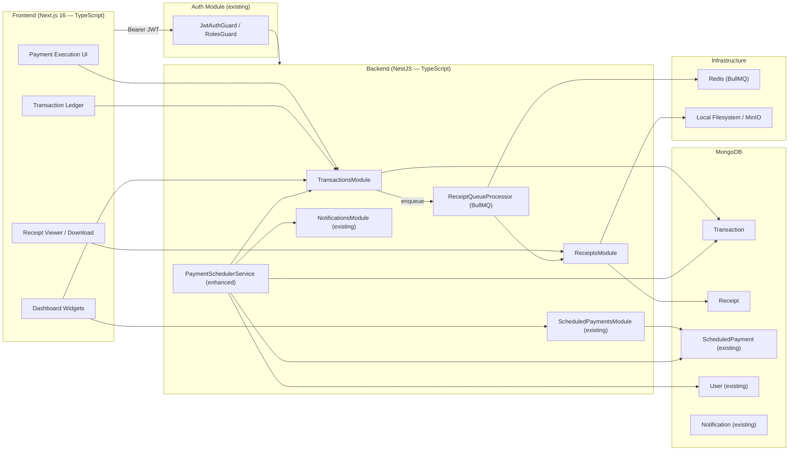
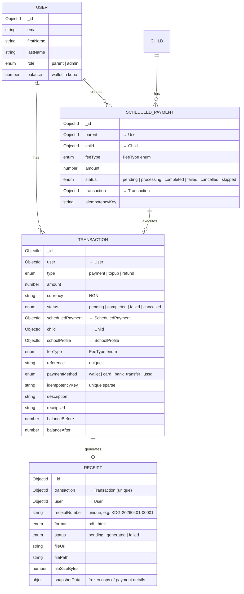
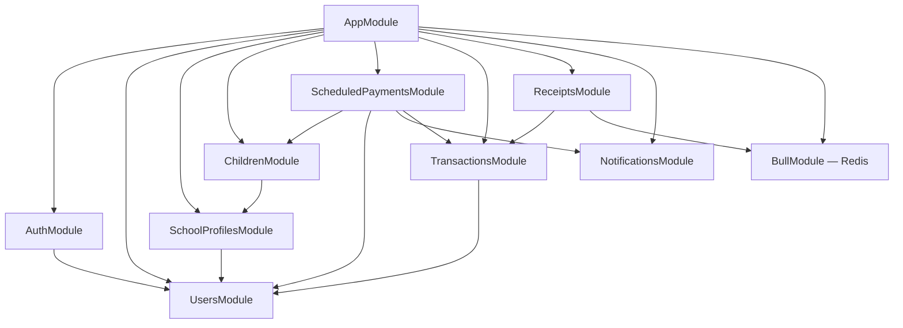
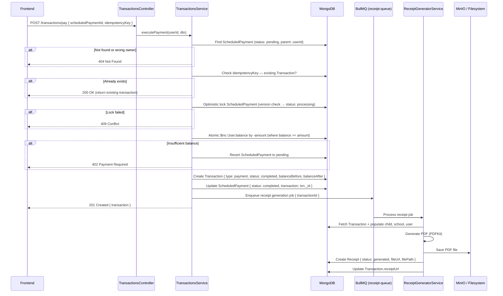
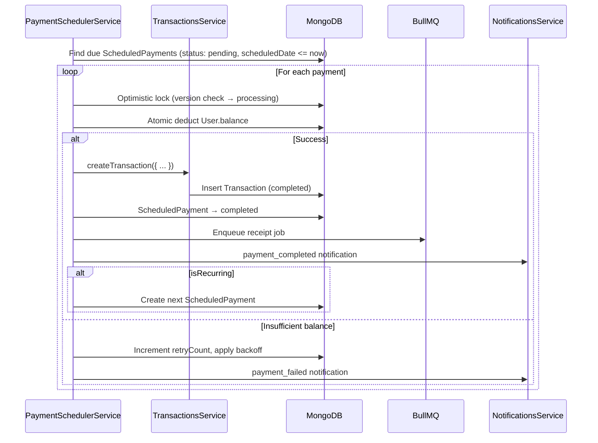
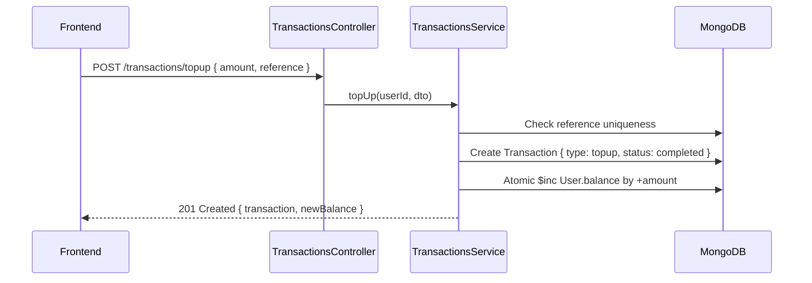
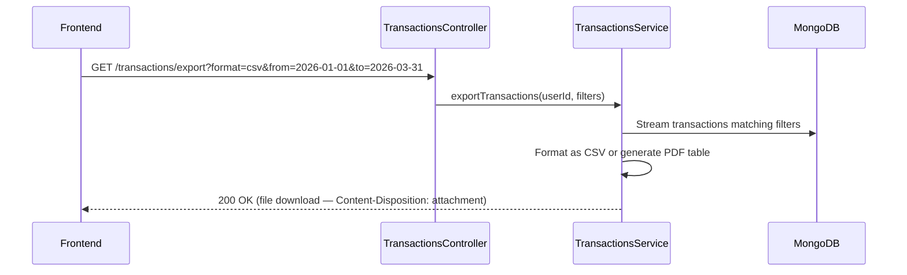

# Design: Payment & Transaction Engine

## System Architecture

### High-Level Overview

The Payment & Transaction Engine extends the existing NestJS backend with two new modules — **TransactionsModule** and **ReceiptsModule** — that work alongside the established `ScheduledPaymentsModule`. The engine handles one-time and recurring payment execution, receipt generation, and a full transaction ledger with filtering, pagination, and export.

The core flow is: **ScheduledPayment (intent) → Transaction (execution) → Receipt (artifact)**. The existing `PaymentSchedulerService` cron job is enhanced to create `Transaction` documents upon successful wallet deduction, and a `Receipt` is generated asynchronously via a BullMQ queue.



### Design Principles

1. **Intent vs. Execution** — `ScheduledPayment` is the payment *intent*; `Transaction` is the *execution record*. A scheduled payment transitions to `completed` only after a `Transaction` is successfully created and the wallet debited.
2. **Idempotent execution** — Every payment operation carries an `idempotencyKey` (derived from `scheduledPayment._id + attempt`). Duplicate requests return the existing transaction.
3. **Async receipt generation** — Receipt PDF creation is offloaded to a BullMQ queue to avoid blocking the payment flow. The `Transaction` is immediately available; the receipt URL is populated asynchronously.
4. **Extend, don't break** — The existing `Transaction` model shape (from legacy `backend/`) is preserved and extended with NestJS-native fields. The existing `PaymentItem` model is left untouched; new payments reference `FeeType` enum + `ScheduledPayment` instead.
5. **Export-friendly ledger** — Transaction history supports server-side CSV and PDF export with date range, status, and fee type filters.

---

## Data Models

### Transaction Schema (NestJS)

Extends the legacy Transaction shape with additional fields for the school wallet context.

```typescript
// transactions/schemas/transaction.schema.ts
import { Prop, Schema, SchemaFactory } from '@nestjs/mongoose';
import { HydratedDocument, Types } from 'mongoose';
import { FeeType, PaymentStatus } from '../../common/enums';

export type TransactionDocument = HydratedDocument<Transaction>;

export enum TransactionType {
  PAYMENT = 'payment',
  TOPUP = 'topup',
  REFUND = 'refund',
}

export enum PaymentMethod {
  WALLET = 'wallet',
  CARD = 'card',
  BANK_TRANSFER = 'bank_transfer',
  USSD = 'ussd',
}

@Schema({ timestamps: true })
export class Transaction {
  @Prop({ type: Types.ObjectId, ref: 'User', required: true, index: true })
  user: Types.ObjectId;

  @Prop({ type: String, enum: TransactionType, required: true })
  type: TransactionType;

  @Prop({ required: true, min: 1 })
  amount: number;

  @Prop({ default: 'NGN' })
  currency: string;

  @Prop({
    type: String,
    enum: PaymentStatus,
    default: PaymentStatus.PENDING,
  })
  status: PaymentStatus;

  @Prop({ type: Types.ObjectId, ref: 'PaymentItem' })
  paymentItem?: Types.ObjectId;

  @Prop({ type: Types.ObjectId, ref: 'ScheduledPayment' })
  scheduledPayment?: Types.ObjectId;

  @Prop({ type: Types.ObjectId, ref: 'Child' })
  child?: Types.ObjectId;

  @Prop({ type: Types.ObjectId, ref: 'SchoolProfile' })
  schoolProfile?: Types.ObjectId;

  @Prop({ type: String, enum: FeeType })
  feeType?: FeeType;

  @Prop({ unique: true, sparse: true })
  reference: string;

  @Prop({ type: String, enum: PaymentMethod, default: PaymentMethod.WALLET })
  paymentMethod: PaymentMethod;

  @Prop({ unique: true, sparse: true })
  idempotencyKey?: string;

  @Prop()
  description?: string;

  @Prop()
  failureReason?: string;

  @Prop({ type: Object })
  metadata?: Record<string, unknown>;

  @Prop()
  receiptUrl?: string;

  @Prop({ type: Number })
  balanceBefore?: number;

  @Prop({ type: Number })
  balanceAfter?: number;
}

export const TransactionSchema = SchemaFactory.createForClass(Transaction);

TransactionSchema.index({ user: 1, createdAt: -1 });
TransactionSchema.index({ user: 1, type: 1, status: 1 });
TransactionSchema.index({ reference: 1 }, { unique: true, sparse: true });
TransactionSchema.index({ idempotencyKey: 1 }, { unique: true, sparse: true });
TransactionSchema.index({ scheduledPayment: 1 });
```

### Receipt Schema

```typescript
// receipts/schemas/receipt.schema.ts
import { Prop, Schema, SchemaFactory } from '@nestjs/mongoose';
import { HydratedDocument, Types } from 'mongoose';

export type ReceiptDocument = HydratedDocument<Receipt>;

export enum ReceiptFormat {
  PDF = 'pdf',
  HTML = 'html',
}

export enum ReceiptStatus {
  PENDING = 'pending',
  GENERATED = 'generated',
  FAILED = 'failed',
}

@Schema({ timestamps: true })
export class Receipt {
  @Prop({ type: Types.ObjectId, ref: 'Transaction', required: true, unique: true })
  transaction: Types.ObjectId;

  @Prop({ type: Types.ObjectId, ref: 'User', required: true, index: true })
  user: Types.ObjectId;

  @Prop({ unique: true })
  receiptNumber: string;

  @Prop({ type: String, enum: ReceiptFormat, default: ReceiptFormat.PDF })
  format: ReceiptFormat;

  @Prop({ type: String, enum: ReceiptStatus, default: ReceiptStatus.PENDING })
  status: ReceiptStatus;

  @Prop()
  fileUrl?: string;

  @Prop()
  filePath?: string;

  @Prop({ type: Number })
  fileSizeBytes?: number;

  @Prop()
  failureReason?: string;

  @Prop({ type: Object })
  snapshotData: {
    amount: number;
    currency: string;
    feeType?: string;
    childName?: string;
    schoolName?: string;
    parentName: string;
    parentEmail: string;
    transactionDate: Date;
    reference: string;
    paymentMethod: string;
  };
}

export const ReceiptSchema = SchemaFactory.createForClass(Receipt);

ReceiptSchema.index({ user: 1, createdAt: -1 });
ReceiptSchema.index({ receiptNumber: 1 }, { unique: true });
```

### Entity Relationship Diagram



### Index Strategy

| Collection | Index | Type | Purpose |
|-----------|-------|------|---------|
| Transaction | `{ user: 1, createdAt: -1 }` | compound | Ledger listing (most recent first) |
| Transaction | `{ user: 1, type: 1, status: 1 }` | compound | Filtered queries |
| Transaction | `{ reference: 1 }` | unique sparse | External reference lookup |
| Transaction | `{ idempotencyKey: 1 }` | unique sparse | Prevent duplicate execution |
| Transaction | `{ scheduledPayment: 1 }` | single | Link back to intent |
| Receipt | `{ user: 1, createdAt: -1 }` | compound | User's receipt list |
| Receipt | `{ receiptNumber: 1 }` | unique | Receipt number lookup |
| Receipt | `{ transaction: 1 }` | unique | One receipt per transaction |

---

## NestJS Module Architecture

### New Modules

```
backend-nestjs/
├── src/
│   ├── transactions/                     # TransactionsModule
│   │   ├── transactions.module.ts
│   │   ├── transactions.controller.ts
│   │   ├── transactions.service.ts
│   │   ├── schemas/transaction.schema.ts
│   │   └── dto/
│   │       ├── create-transaction.dto.ts
│   │       ├── query-transaction.dto.ts
│   │       └── export-transaction.dto.ts
│   │
│   ├── receipts/                         # ReceiptsModule
│   │   ├── receipts.module.ts
│   │   ├── receipts.controller.ts
│   │   ├── receipts.service.ts
│   │   ├── receipt-generator.service.ts  # PDF generation logic
│   │   ├── receipt-queue.processor.ts    # BullMQ processor
│   │   ├── schemas/receipt.schema.ts
│   │   └── dto/
│   │       └── query-receipt.dto.ts
│   │
│   ├── common/
│   │   └── enums/
│   │       ├── transaction-type.enum.ts  # NEW
│   │       ├── payment-method.enum.ts    # NEW
│   │       └── receipt-status.enum.ts    # NEW
```

### Module Dependency Graph



---

## Core Flows

### Payment Execution Flow (One-Time — Manual Pay Now)



### Automated Recurring Payment Flow (Cron — Enhanced)



### Wallet Top-Up Flow



### Ledger Export Flow



---

## API Contracts

All endpoints require `Authorization: Bearer <accessToken>`. Parent-scoped via `@Roles(UserRole.PARENT)`.

### Transactions — `/transactions`

#### POST `/transactions/pay` — Execute payment from scheduled payment

```typescript
// Request
export class ExecutePaymentDto {
  @IsMongoId()
  scheduledPaymentId: string;

  @IsOptional() @IsString()
  idempotencyKey?: string; // Auto-generated if omitted
}

// Response 201
{
  message: "Payment executed successfully",
  transaction: Transaction,
  newBalance: number
}

// Error responses: 402 (insufficient balance), 404 (not found), 409 (conflict)
```

#### POST `/transactions/topup` — Add funds to wallet

```typescript
// Request
export class TopUpDto {
  @IsNumber() @Min(100) @Max(10_000_000)
  amount: number;

  @IsString()
  reference: string; // From payment gateway callback

  @IsOptional() @IsEnum(PaymentMethod)
  paymentMethod?: PaymentMethod;

  @IsOptional() @IsObject()
  metadata?: Record<string, unknown>; // Gateway response data
}

// Response 201
{
  message: "Wallet topped up successfully",
  transaction: Transaction,
  newBalance: number
}
```

#### GET `/transactions` — List transaction ledger

```typescript
// Query params
export class QueryTransactionDto {
  @IsOptional() @IsEnum(TransactionType)
  type?: TransactionType;

  @IsOptional() @IsEnum(PaymentStatus)
  status?: PaymentStatus;

  @IsOptional() @IsEnum(FeeType)
  feeType?: FeeType;

  @IsOptional() @IsDateString()
  from?: string;

  @IsOptional() @IsDateString()
  to?: string;

  @IsOptional() @IsMongoId()
  child?: string;

  @IsOptional() @IsMongoId()
  schoolProfile?: string;

  @IsOptional() @Type(() => Number) @IsNumber() @Min(1)
  page?: number = 1;

  @IsOptional() @Type(() => Number) @IsNumber() @Min(1) @Max(100)
  limit?: number = 20;

  @IsOptional() @IsString()
  sortBy?: string = 'createdAt';

  @IsOptional() @IsEnum(['asc', 'desc'])
  sortOrder?: 'asc' | 'desc' = 'desc';
}

// Response 200
{
  transactions: Transaction[],
  pagination: { page, limit, total, pages },
  summary: {
    totalPayments: number,
    totalTopUps: number,
    totalRefunds: number,
    netFlow: number
  }
}
```

#### GET `/transactions/:id` — Get transaction detail

```typescript
// Response 200
{
  transaction: Transaction // populated with child, schoolProfile, receipt
}
```

#### GET `/transactions/export` — Export ledger

```typescript
// Query params
export class ExportTransactionDto extends QueryTransactionDto {
  @IsEnum(['csv', 'pdf'])
  format: 'csv' | 'pdf';
}

// Response 200 — file download
// Content-Type: text/csv or application/pdf
// Content-Disposition: attachment; filename="kudegowo-transactions-2026-01-01-to-2026-03-31.csv"
```

#### GET `/transactions/summary` — Aggregated stats

```typescript
// Response 200
{
  totalSpent: number,       // sum of completed payments
  totalTopUps: number,      // sum of completed top-ups
  totalRefunds: number,     // sum of completed refunds
  currentBalance: number,
  transactionCount: number,
  monthlyBreakdown: Array<{
    month: string,          // "2026-01"
    payments: number,
    topUps: number,
    refunds: number
  }>
}
```

### Receipts — `/receipts`

#### GET `/receipts` — List receipts

```typescript
// Query params
export class QueryReceiptDto {
  @IsOptional() @IsDateString()
  from?: string;

  @IsOptional() @IsDateString()
  to?: string;

  @IsOptional() @Type(() => Number) @IsNumber() @Min(1)
  page?: number = 1;

  @IsOptional() @Type(() => Number) @IsNumber() @Min(1) @Max(100)
  limit?: number = 20;
}

// Response 200
{
  receipts: Receipt[],
  pagination: { page, limit, total, pages }
}
```

#### GET `/receipts/:id` — Get receipt detail

```typescript
// Response 200
{
  receipt: Receipt // with populated transaction
}
```

#### GET `/receipts/:id/download` — Download receipt file

```typescript
// Response 200 — file stream
// Content-Type: application/pdf
// Content-Disposition: attachment; filename="KDG-20260401-00001.pdf"
```

#### POST `/receipts/:transactionId/regenerate` — Re-generate a failed receipt

```typescript
// Response 202
{
  message: "Receipt regeneration queued",
  receipt: Receipt
}
```

---

## Receipt Generation

### Receipt Number Format

```
KDG-YYYYMMDD-NNNNN
```

- `KDG` — Kudegowo prefix
- `YYYYMMDD` — Transaction date
- `NNNNN` — Daily sequential counter (zero-padded, resets daily)

Sequential counter is maintained via an atomic MongoDB counter document:

```typescript
// receipts/schemas/receipt-counter.schema.ts
@Schema()
export class ReceiptCounter {
  @Prop({ required: true, unique: true })
  date: string; // "2026-04-01"

  @Prop({ default: 0 })
  count: number;
}

// Usage: findOneAndUpdate({ date }, { $inc: { count: 1 } }, { upsert: true, new: true })
```

### PDF Template (PDFKit)

```typescript
// receipts/receipt-generator.service.ts
@Injectable()
export class ReceiptGeneratorService {
  async generate(transaction: TransactionDocument): Promise<Buffer> {
    const doc = new PDFDocument({ size: 'A4', margin: 50 });

    // Header: Kudegowo logo + "Payment Receipt"
    // Receipt number + date
    // Parent details (name, email)
    // Payment details table:
    //   - Fee Type | Description | Child | School | Amount
    // Payment method + reference
    // Balance before/after
    // Footer: "This is a computer-generated receipt"

    return bufferFromStream(doc);
  }
}
```

### BullMQ Queue Configuration

```typescript
// receipts/receipts.module.ts
@Module({
  imports: [
    BullModule.registerQueue({
      name: 'receipt-generation',
      defaultJobOptions: {
        attempts: 3,
        backoff: { type: 'exponential', delay: 5000 },
        removeOnComplete: 100,
        removeOnFail: 500,
      },
    }),
  ],
})
```

---

## Security Design

### Data Isolation

Every query is scoped to `user._id`:

```typescript
// transactions.service.ts
async findAll(userId: string, query: QueryTransactionDto) {
  const filter: FilterQuery<Transaction> = { user: new Types.ObjectId(userId) };
  if (query.type) filter.type = query.type;
  if (query.status) filter.status = query.status;
  if (query.from || query.to) {
    filter.createdAt = {};
    if (query.from) filter.createdAt.$gte = new Date(query.from);
    if (query.to) filter.createdAt.$lte = new Date(query.to);
  }
  // ... paginate and return
}
```

### Input Validation

All DTOs use `class-validator`. The global `ValidationPipe` strips unknown properties and auto-transforms types.

### Idempotency

- **Manual payments**: Client can send an `idempotencyKey`. If omitted, the server generates one from `scheduledPayment._id`.
- **Top-ups**: The `reference` field (from payment gateway) acts as the natural idempotency key.
- **Cron payments**: The existing `idempotencyKey` on `ScheduledPayment` prevents double-execution. Transaction creation checks `idempotencyKey` uniqueness.

### Concurrency Safety

1. **Wallet deduction**: Atomic `$inc` with balance check (`balance: { $gte: amount }`). No race conditions.
2. **Optimistic locking**: `ScheduledPayment.version` prevents double-processing (same as existing scheduler).
3. **Receipt generation**: Queue-based — only one processor picks up each job. BullMQ handles retries.

### Rate Limiting

| Endpoint | Limit | Window |
|----------|-------|--------|
| POST `/transactions/pay` | 10 | 1 minute |
| POST `/transactions/topup` | 5 | 1 minute |
| GET `/transactions/export` | 3 | 1 minute |
| POST `/receipts/*/regenerate` | 5 | 5 minutes |

### Export Size Limits

- CSV export: max 10,000 rows per export
- PDF export: max 1,000 rows per export (pagination required for larger sets)

---

## Frontend Architecture

### New Pages

| Route | Component | Description |
|-------|-----------|-------------|
| `/dashboard/transactions` | TransactionLedger | Full transaction history with filters and search |
| `/dashboard/transactions/[id]` | TransactionDetail | Single transaction with receipt download |
| `/dashboard/wallet` | WalletPage | Balance, top-up form, recent activity |

### Updated Pages

| Route | Change |
|-------|--------|
| `/dashboard` | Add wallet balance card, recent transactions widget |
| `/dashboard/scheduled-payments` | "Pay Now" button triggers POST `/transactions/pay` |

### Component Structure

```
frontend/
├── app/dashboard/
│   ├── transactions/
│   │   ├── page.tsx              # TransactionLedger
│   │   └── [id]/
│   │       └── page.tsx          # TransactionDetail
│   ├── wallet/
│   │   └── page.tsx              # WalletPage (balance + top-up)
│   └── page.tsx                  # Dashboard (enhanced)
├── components/
│   ├── transactions/
│   │   ├── TransactionTable.tsx   # Sortable, filterable table
│   │   ├── TransactionFilters.tsx # Date range, type, status filters
│   │   ├── TransactionRow.tsx     # Single row with receipt icon
│   │   └── ExportButton.tsx       # CSV/PDF export trigger
│   ├── wallet/
│   │   ├── BalanceCard.tsx        # Current balance display
│   │   ├── TopUpForm.tsx          # Amount input + payment method
│   │   └── RecentActivity.tsx     # Last 5 transactions
│   └── receipts/
│       ├── ReceiptViewer.tsx      # In-app receipt preview
│       └── DownloadButton.tsx     # Download receipt PDF
```

### API Client Extensions

```typescript
// frontend/lib/api.ts — additions

export interface Transaction {
  _id: string;
  user: string;
  type: TransactionType;
  amount: number;
  currency: string;
  status: PaymentStatus;
  scheduledPayment?: string;
  child?: Child | string;
  schoolProfile?: SchoolProfile | string;
  feeType?: FeeType;
  reference: string;
  paymentMethod: PaymentMethod;
  description?: string;
  receiptUrl?: string;
  balanceBefore?: number;
  balanceAfter?: number;
  createdAt: string;
  updatedAt: string;
}

export interface Receipt {
  _id: string;
  transaction: string;
  user: string;
  receiptNumber: string;
  format: 'pdf' | 'html';
  status: 'pending' | 'generated' | 'failed';
  fileUrl?: string;
  snapshotData: { ... };
  createdAt: string;
}

export const transactionApi = {
  list: (params?: QueryTransactionDto) => apiFetch<{ transactions: Transaction[]; pagination: Pagination; summary: object }>(`/transactions?${toQs(params)}`),
  get: (id: string) => apiFetch<{ transaction: Transaction }>(`/transactions/${id}`),
  pay: (dto: { scheduledPaymentId: string; idempotencyKey?: string }) => apiFetch<{ transaction: Transaction; newBalance: number }>('/transactions/pay', { method: 'POST', body: JSON.stringify(dto) }),
  topUp: (dto: { amount: number; reference: string; paymentMethod?: string }) => apiFetch<{ transaction: Transaction; newBalance: number }>('/transactions/topup', { method: 'POST', body: JSON.stringify(dto) }),
  summary: () => apiFetch<TransactionSummary>('/transactions/summary'),
  export: (params: ExportParams) => window.open(`${API_BASE}/transactions/export?${toQs(params)}`),
};

export const receiptApi = {
  list: (params?: { from?: string; to?: string; page?: number; limit?: number }) => apiFetch<{ receipts: Receipt[]; pagination: Pagination }>(`/receipts?${toQs(params)}`),
  get: (id: string) => apiFetch<{ receipt: Receipt }>(`/receipts/${id}`),
  download: (id: string) => window.open(`${API_BASE}/receipts/${id}/download`),
  regenerate: (transactionId: string) => apiFetch<{ receipt: Receipt }>(`/receipts/${transactionId}/regenerate`, { method: 'POST' }),
};
```

### Sidebar Navigation Update

Add to sidebar:
- **Transactions** (icon: `Receipt`) → `/dashboard/transactions`
- **Wallet** (icon: `Wallet`) → `/dashboard/wallet`

---

## Implementation Notes

### Phase 1: Transaction Model + Manual Pay (Week 1-2)
1. Create `TransactionsModule` with schema, service, controller, DTOs
2. Add `TransactionType`, `PaymentMethod` enums to `common/enums/`
3. Implement `POST /transactions/pay` (wallet deduction + transaction creation)
4. Enhance `PaymentSchedulerService` to create Transaction on cron execution
5. Implement `POST /transactions/topup` (stub — gateway integration in Multi-Payment feature)
6. Implement `GET /transactions` with filtering and pagination

### Phase 2: Receipts (Week 3-4)
1. Set up Redis + BullMQ (`@nestjs/bullmq`)
2. Create `ReceiptsModule` with schema, service, generator, queue processor
3. Implement PDFKit receipt template
4. Wire receipt queue into payment execution flow
5. Implement receipt API endpoints

### Phase 3: Export + Frontend (Week 5-6)
1. Implement CSV export (streaming via `fast-csv`)
2. Implement PDF export (table layout via PDFKit)
3. Build TransactionLedger page with filters
4. Build WalletPage with balance + recent activity
5. Add "Pay Now" to ScheduledPayments page
6. Dashboard enhancements (balance card, recent transactions)

### Phase 4: Polish (Week 7-8)
1. Receipt email delivery (optional — requires email service)
2. Transaction summary aggregation pipeline
3. Monthly breakdown chart on dashboard
4. E2E tests for payment flow

### Backward Compatibility

- The `Transaction` model preserves the legacy shape (`user`, `type`, `amount`, `status`, `paymentItem`, `reference`, `paymentMethod`, `metadata`). New fields are additive.
- `PaymentItem` is NOT modified. New payments use `FeeType` enum + `ScheduledPayment` reference instead.
- Existing `ScheduledPayment.transaction` field (already defined in schema) is now populated on completion.

### Environment Variables (New)

```bash
# .env additions
REDIS_URL=redis://localhost:6379
RECEIPT_STORAGE_PATH=./uploads/receipts       # Local filesystem path
RECEIPT_STORAGE_TYPE=local                      # 'local' | 'minio'
MINIO_ENDPOINT=localhost                        # If using MinIO
MINIO_PORT=9000
MINIO_ACCESS_KEY=minioadmin
MINIO_SECRET_KEY=minioadmin
MINIO_BUCKET=kudegowo-receipts
```
