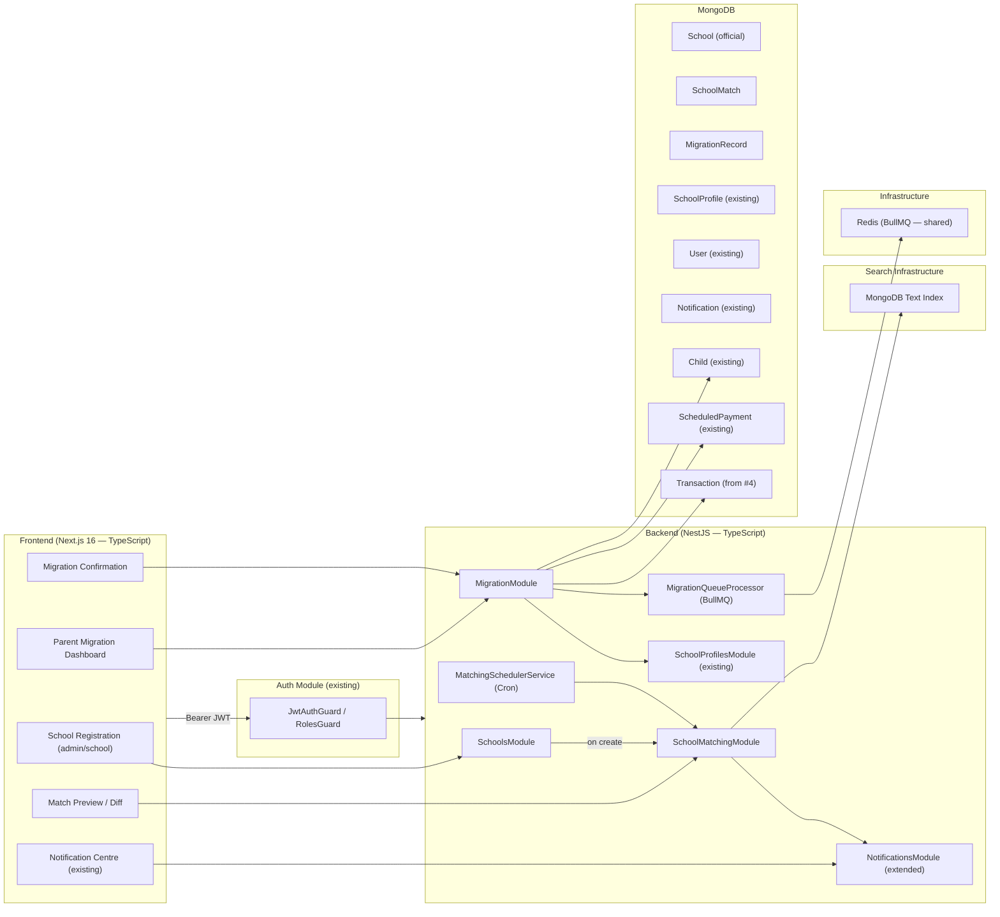
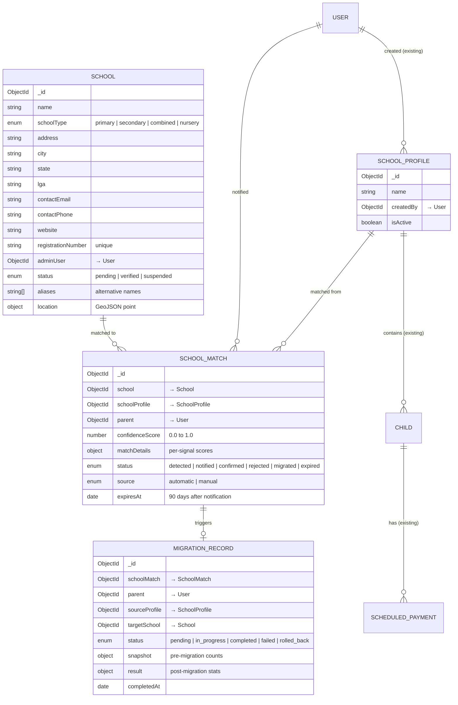
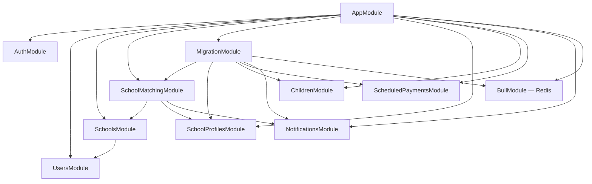
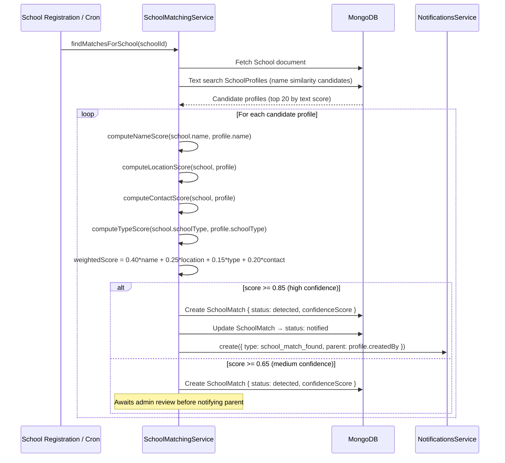
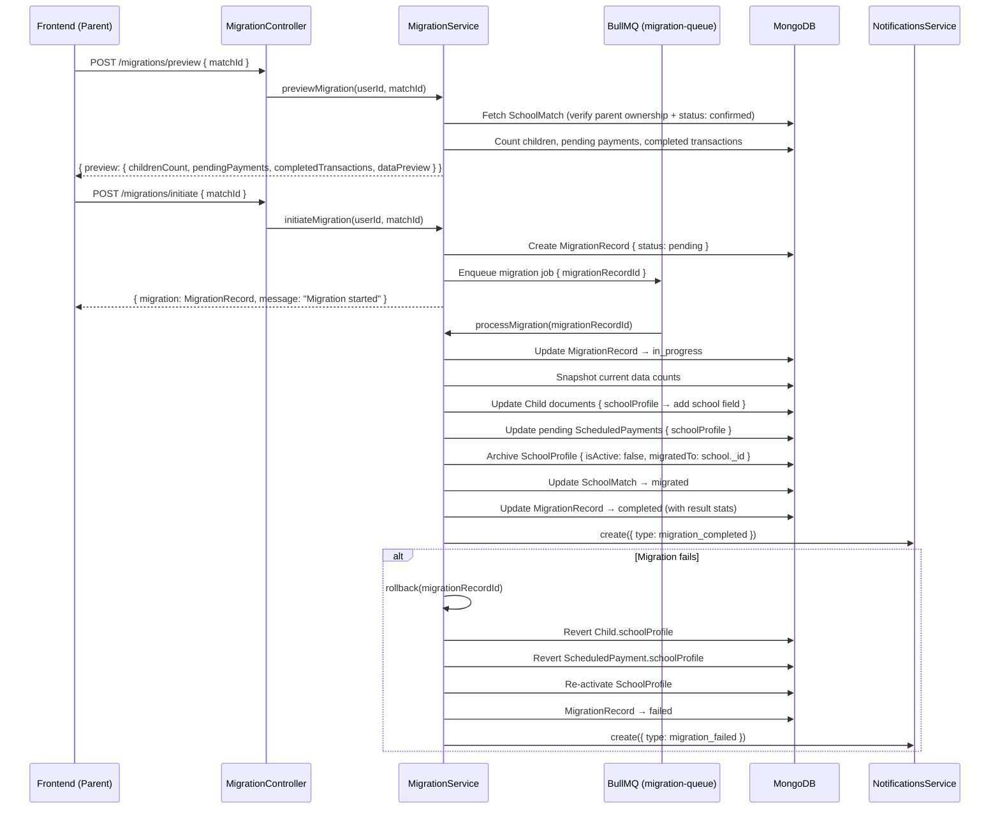
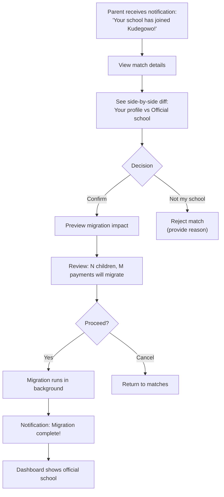

# Design: Smart School Onboarding Detection

## System Architecture

### High-Level Overview

Smart School Onboarding Detection bridges the gap between **independent school profiles** (created by parents) and **official school accounts** (when a real school registers on the platform). The system detects when a school joins Kudegowo, matches it against parents' independently-tracked profiles, notifies affected parents, and offers a guided migration path that preserves all historical payment data.

This feature introduces three new NestJS modules — **SchoolsModule** (official school entities), **SchoolMatchingModule** (fuzzy matching engine), and **MigrationModule** (data migration orchestrator). It also extends the existing `NotificationsModule` with new event types.



### Design Principles

1. **Opt-in migration** — Parents are notified of a match but **never** auto-migrated. The parent must explicitly review the match, preview data differences, and confirm the migration.
2. **Non-destructive** — Migration uses a **copy-on-write** strategy. Original `SchoolProfile` data is archived (soft-deleted), not overwritten. Historical transactions retain their original `schoolProfile` reference.
3. **Fuzzy but conservative** — The matching algorithm prioritizes precision over recall. A false positive (incorrect match) is far worse than a missed match. Multiple signals (name, location, contact info) are combined into a confidence score.
4. **Gradual rollout** — Schools onboard at different times. The system runs matching continuously (cron) and handles matches one at a time, not in bulk.
5. **Extend, don't break** — Existing `SchoolProfile`, `Child`, `ScheduledPayment`, and `Transaction` models are not altered. New fields are additive. The `School` model is a new, separate entity.
6. **Conflict resolution** — When multiple parents independently track the same school, each gets their own match notification and migration path. Migrations are independent per parent.

---

## Data Models

### School Schema (Official School Entity)

Represents a real school that has registered on the Kudegowo platform. Distinct from `SchoolProfile` (parent-created independent profile).

```typescript
// schools/schemas/school.schema.ts
import { Prop, Schema, SchemaFactory } from '@nestjs/mongoose';
import { HydratedDocument, Types } from 'mongoose';
import { SchoolType } from '../../common/enums';

export type SchoolDocument = HydratedDocument<School>;

export enum SchoolStatus {
  PENDING = 'pending',       // Registration submitted, awaiting verification
  VERIFIED = 'verified',     // Admin-verified, active on platform
  SUSPENDED = 'suspended',   // Temporarily disabled
}

@Schema({ timestamps: true })
export class School {
  @Prop({ required: true, trim: true, maxlength: 200 })
  name: string;

  @Prop({ type: String, enum: SchoolType, required: true })
  schoolType: SchoolType;

  @Prop({ trim: true, maxlength: 300 })
  address?: string;

  @Prop({ trim: true, maxlength: 100 })
  city?: string;

  @Prop({ trim: true, maxlength: 100 })
  state?: string;

  @Prop({ trim: true, maxlength: 100 })
  lga?: string; // Local Government Area — Nigerian administrative unit

  @Prop()
  contactEmail?: string;

  @Prop()
  contactPhone?: string;

  @Prop()
  website?: string;

  @Prop({ unique: true, sparse: true })
  registrationNumber?: string; // Government school registration number

  @Prop({ type: Types.ObjectId, ref: 'User' })
  adminUser?: Types.ObjectId; // School admin account

  @Prop({
    type: String,
    enum: SchoolStatus,
    default: SchoolStatus.PENDING,
  })
  status: SchoolStatus;

  @Prop({ default: true })
  isActive: boolean;

  @Prop({ type: [String], default: [] })
  aliases: string[]; // Alternative names (e.g., "FGGC Benin" for "Federal Government Girls' College, Benin")

  @Prop({ type: Object })
  location?: {
    type: 'Point';
    coordinates: [number, number]; // [longitude, latitude]
  };

  @Prop({ type: Object })
  metadata?: Record<string, unknown>;
}

export const SchoolSchema = SchemaFactory.createForClass(School);

SchoolSchema.index({ name: 'text', aliases: 'text', address: 'text', city: 'text' }, {
  weights: { name: 10, aliases: 8, city: 3, address: 2 },
  name: 'school_text_search',
});
SchoolSchema.index({ state: 1, city: 1, schoolType: 1 });
SchoolSchema.index({ registrationNumber: 1 }, { unique: true, sparse: true });
SchoolSchema.index({ status: 1, isActive: 1 });
SchoolSchema.index({ location: '2dsphere' }, { sparse: true });
```

### SchoolMatch Schema

Represents a detected match between an official `School` and a parent's `SchoolProfile`.

```typescript
// school-matching/schemas/school-match.schema.ts
import { Prop, Schema, SchemaFactory } from '@nestjs/mongoose';
import { HydratedDocument, Types } from 'mongoose';

export type SchoolMatchDocument = HydratedDocument<SchoolMatch>;

export enum MatchStatus {
  DETECTED = 'detected',       // Match found by algorithm
  NOTIFIED = 'notified',       // Parent has been notified
  CONFIRMED = 'confirmed',     // Parent confirmed the match
  REJECTED = 'rejected',       // Parent said "not my school"
  MIGRATED = 'migrated',       // Migration completed
  EXPIRED = 'expired',         // No action after 90 days
}

export enum MatchSource {
  AUTOMATIC = 'automatic',     // Detected by cron/matching engine
  MANUAL = 'manual',           // Admin-linked
}

@Schema({ timestamps: true })
export class SchoolMatch {
  @Prop({ type: Types.ObjectId, ref: 'School', required: true })
  school: Types.ObjectId; // Official school

  @Prop({ type: Types.ObjectId, ref: 'SchoolProfile', required: true })
  schoolProfile: Types.ObjectId; // Parent's independent profile

  @Prop({ type: Types.ObjectId, ref: 'User', required: true, index: true })
  parent: Types.ObjectId; // Affected parent

  @Prop({ required: true, min: 0, max: 1 })
  confidenceScore: number; // 0.0 — 1.0

  @Prop({ type: Object })
  matchDetails: {
    nameScore: number;       // Fuzzy name similarity (0-1)
    locationScore: number;   // City/state match (0-1)
    contactScore: number;    // Phone/email overlap (0-1)
    typeScore: number;       // SchoolType match (0 or 1)
    signals: string[];       // Human-readable match reasons
  };

  @Prop({
    type: String,
    enum: MatchStatus,
    default: MatchStatus.DETECTED,
  })
  status: MatchStatus;

  @Prop({ type: String, enum: MatchSource, default: MatchSource.AUTOMATIC })
  source: MatchSource;

  @Prop()
  parentNote?: string; // Parent's comment when confirming/rejecting

  @Prop({ type: Date })
  notifiedAt?: Date;

  @Prop({ type: Date })
  respondedAt?: Date;

  @Prop({ type: Date })
  expiresAt?: Date; // 90 days after notification
}

export const SchoolMatchSchema = SchemaFactory.createForClass(SchoolMatch);

SchoolMatchSchema.index({ parent: 1, status: 1 });
SchoolMatchSchema.index({ school: 1, schoolProfile: 1 }, { unique: true });
SchoolMatchSchema.index({ status: 1, expiresAt: 1 });
SchoolMatchSchema.index({ school: 1, status: 1 });
```

### MigrationRecord Schema

Tracks the data migration from an independent `SchoolProfile` to an official `School`.

```typescript
// migration/schemas/migration-record.schema.ts
import { Prop, Schema, SchemaFactory } from '@nestjs/mongoose';
import { HydratedDocument, Types } from 'mongoose';

export type MigrationRecordDocument = HydratedDocument<MigrationRecord>;

export enum MigrationStatus {
  PENDING = 'pending',
  IN_PROGRESS = 'in_progress',
  COMPLETED = 'completed',
  FAILED = 'failed',
  ROLLED_BACK = 'rolled_back',
}

@Schema({ timestamps: true })
export class MigrationRecord {
  @Prop({ type: Types.ObjectId, ref: 'SchoolMatch', required: true, unique: true })
  schoolMatch: Types.ObjectId;

  @Prop({ type: Types.ObjectId, ref: 'User', required: true, index: true })
  parent: Types.ObjectId;

  @Prop({ type: Types.ObjectId, ref: 'SchoolProfile', required: true })
  sourceProfile: Types.ObjectId; // Independent school profile (archived after migration)

  @Prop({ type: Types.ObjectId, ref: 'School', required: true })
  targetSchool: Types.ObjectId; // Official school entity

  @Prop({
    type: String,
    enum: MigrationStatus,
    default: MigrationStatus.PENDING,
  })
  status: MigrationStatus;

  @Prop({ type: Object })
  snapshot: {
    childrenCount: number;
    scheduledPaymentsCount: number;
    transactionsCount: number;
    totalAmountPaid: number;
  };

  @Prop({ type: Object })
  result?: {
    childrenMigrated: number;
    scheduledPaymentsMigrated: number;
    errors: string[];
  };

  @Prop()
  failureReason?: string;

  @Prop({ type: Date })
  startedAt?: Date;

  @Prop({ type: Date })
  completedAt?: Date;
}

export const MigrationRecordSchema = SchemaFactory.createForClass(MigrationRecord);

MigrationRecordSchema.index({ parent: 1, status: 1 });
MigrationRecordSchema.index({ sourceProfile: 1 });
MigrationRecordSchema.index({ schoolMatch: 1 }, { unique: true });
```

### Entity Relationship Diagram



### Index Strategy

| Collection | Index | Type | Purpose |
|-----------|-------|------|---------|
| School | `{ name: 'text', aliases: 'text', address: 'text', city: 'text' }` | text (weighted) | Fuzzy search for matching |
| School | `{ state: 1, city: 1, schoolType: 1 }` | compound | Location-based filtering |
| School | `{ registrationNumber: 1 }` | unique sparse | Government ID lookup |
| School | `{ status: 1, isActive: 1 }` | compound | Active school queries |
| School | `{ location: '2dsphere' }` | geospatial sparse | Proximity matching |
| SchoolMatch | `{ parent: 1, status: 1 }` | compound | Parent's pending matches |
| SchoolMatch | `{ school: 1, schoolProfile: 1 }` | unique compound | Prevent duplicate matches |
| SchoolMatch | `{ status: 1, expiresAt: 1 }` | compound | Expiration cron |
| SchoolMatch | `{ school: 1, status: 1 }` | compound | Find all matches for a school |
| MigrationRecord | `{ parent: 1, status: 1 }` | compound | Parent's migrations |
| MigrationRecord | `{ sourceProfile: 1 }` | single | Find migration by source |
| MigrationRecord | `{ schoolMatch: 1 }` | unique | One migration per match |

---

## NestJS Module Architecture

### New Modules

```
backend-nestjs/
├── src/
│   ├── schools/                              # SchoolsModule (official school entities)
│   │   ├── schools.module.ts
│   │   ├── schools.controller.ts
│   │   ├── schools.service.ts
│   │   ├── schemas/school.schema.ts
│   │   └── dto/
│   │       ├── create-school.dto.ts
│   │       ├── update-school.dto.ts
│   │       └── query-school.dto.ts
│   │
│   ├── school-matching/                      # SchoolMatchingModule
│   │   ├── school-matching.module.ts
│   │   ├── school-matching.controller.ts     # Admin + parent endpoints
│   │   ├── school-matching.service.ts        # Core matching engine
│   │   ├── matching-scheduler.service.ts     # Cron: run matching on new schools
│   │   ├── schemas/school-match.schema.ts
│   │   └── dto/
│   │       ├── respond-match.dto.ts
│   │       └── query-match.dto.ts
│   │
│   ├── migration/                            # MigrationModule
│   │   ├── migration.module.ts
│   │   ├── migration.controller.ts
│   │   ├── migration.service.ts
│   │   ├── migration-queue.processor.ts      # BullMQ processor
│   │   ├── schemas/migration-record.schema.ts
│   │   └── dto/
│   │       ├── initiate-migration.dto.ts
│   │       └── query-migration.dto.ts
│   │
│   ├── common/
│   │   └── enums/
│   │       ├── school-status.enum.ts         # NEW
│   │       ├── match-status.enum.ts          # NEW
│   │       └── migration-status.enum.ts      # NEW
```

### Module Dependency Graph



---

## School Matching Algorithm

### Overview

The matching engine compares each official `School` against all active `SchoolProfile` documents using multiple signals. Each signal produces a score between 0 and 1. Signals are combined into a weighted confidence score.

### Signal Weights

| Signal | Weight | Description |
|--------|--------|-------------|
| Name similarity | 0.40 | Fuzzy text match (Levenshtein + token-based) |
| Location match | 0.25 | City + state match |
| School type match | 0.15 | Same SchoolType enum value |
| Contact overlap | 0.20 | Phone and/or email match |

### Confidence Thresholds

| Score Range | Action |
|-------------|--------|
| ≥ 0.85 | **High confidence** — auto-notify parent |
| 0.65 – 0.84 | **Medium confidence** — flag for admin review before notifying |
| < 0.65 | **No match** — discard |

### Name Matching Algorithm

```typescript
// school-matching/school-matching.service.ts

private computeNameScore(schoolName: string, profileName: string): number {
  const normalize = (s: string) =>
    s.toLowerCase()
      .replace(/[^a-z0-9\s]/g, '')   // Remove punctuation
      .replace(/\b(the|of|and|for|school|college|academy|international|nursery|primary|secondary)\b/g, '') // Stop words
      .replace(/\s+/g, ' ')
      .trim();

  const a = normalize(schoolName);
  const b = normalize(profileName);

  // 1. Exact match after normalization
  if (a === b) return 1.0;

  // 2. Token-based Jaccard similarity
  const tokensA = new Set(a.split(' '));
  const tokensB = new Set(b.split(' '));
  const intersection = new Set([...tokensA].filter(t => tokensB.has(t)));
  const union = new Set([...tokensA, ...tokensB]);
  const jaccard = intersection.size / union.size;

  // 3. Levenshtein-based similarity (normalized)
  const maxLen = Math.max(a.length, b.length);
  const levenshtein = 1 - (levenshteinDistance(a, b) / maxLen);

  // 4. Check aliases
  // (School.aliases are checked separately in the main matching loop)

  // Combine: weight Jaccard higher for multi-word names
  return tokensA.size > 2
    ? 0.6 * jaccard + 0.4 * levenshtein
    : 0.4 * jaccard + 0.6 * levenshtein;
}
```

### Location Matching

```typescript
private computeLocationScore(school: SchoolDocument, profile: SchoolProfileDocument): number {
  let score = 0;

  // State match (case-insensitive)
  if (school.state && profile.state &&
      school.state.toLowerCase() === profile.state.toLowerCase()) {
    score += 0.4;
  }

  // City match (case-insensitive, with common abbreviation handling)
  if (school.city && profile.city) {
    const cityA = this.normalizeCity(school.city);
    const cityB = this.normalizeCity(profile.city);
    if (cityA === cityB) score += 0.6;
    else if (cityA.includes(cityB) || cityB.includes(cityA)) score += 0.4;
  }

  // Geospatial proximity (if both have coordinates)
  // Within 2km = full location score
  // 2-10km = partial score
  // > 10km = no bonus

  return Math.min(score, 1.0);
}
```

### Contact Matching

```typescript
private computeContactScore(school: SchoolDocument, profile: SchoolProfileDocument): number {
  let score = 0;
  let signals = 0;

  if (school.contactPhone && profile.contactPhone) {
    signals++;
    const normalizePhone = (p: string) => p.replace(/\D/g, '').slice(-10); // Last 10 digits
    if (normalizePhone(school.contactPhone) === normalizePhone(profile.contactPhone)) {
      score += 1.0;
    }
  }

  if (school.contactEmail && profile.contactEmail) {
    signals++;
    if (school.contactEmail.toLowerCase() === profile.contactEmail.toLowerCase()) {
      score += 1.0;
    }
  }

  return signals > 0 ? score / signals : 0;
}
```

### Matching Flow



### Matching Scheduler (Cron)

```typescript
// school-matching/matching-scheduler.service.ts

@Injectable()
export class MatchingSchedulerService {
  @Cron('0 2 * * *') // Daily at 2am
  async matchNewSchools(): Promise<void> {
    // Find schools registered in the last 24 hours that haven't been matched yet
    const newSchools = await this.schoolModel.find({
      status: SchoolStatus.VERIFIED,
      createdAt: { $gte: yesterday() },
    });

    for (const school of newSchools) {
      await this.matchingService.findMatchesForSchool(school._id.toString());
    }
  }

  @Cron('0 3 * * *') // Daily at 3am
  async expireStaleMatches(): Promise<void> {
    // Expire matches that have been notified but not responded to within 90 days
    await this.matchModel.updateMany(
      { status: MatchStatus.NOTIFIED, expiresAt: { $lt: new Date() } },
      { $set: { status: MatchStatus.EXPIRED } },
    );
  }
}
```

---

## Migration Design

### Migration Strategy: Copy-on-Write

When a parent confirms a match and initiates migration:

1. **Snapshot** — Record current counts (children, payments, transactions) for audit.
2. **Link children** — Update `Child.schoolProfile` from the old `SchoolProfile._id` to reference a new field `Child.school` pointing to the official `School._id`. The original `schoolProfile` reference is preserved in `Child.legacySchoolProfile`.
3. **Link pending payments** — Update `ScheduledPayment.schoolProfile` for **pending** payments only. Completed payments retain their original reference.
4. **Archive source profile** — Set `SchoolProfile.isActive = false` and add `SchoolProfile.migratedTo = school._id`.
5. **Historical preservation** — Completed `Transaction` and `ScheduledPayment` documents are NOT modified. They retain their original `schoolProfile` reference, ensuring historical accuracy.

### Migration Sequence



### Schema Extensions (Additive — Existing Models)

```typescript
// Additive field on Child schema
@Prop({ type: Types.ObjectId, ref: 'School' })
school?: Types.ObjectId; // Set after migration to official school

@Prop({ type: Types.ObjectId, ref: 'SchoolProfile' })
legacySchoolProfile?: Types.ObjectId; // Preserved for audit

// Additive field on SchoolProfile schema
@Prop({ type: Types.ObjectId, ref: 'School' })
migratedTo?: Types.ObjectId; // Set when migrated to official school

// Additive field on ScheduledPayment schema
@Prop({ type: Types.ObjectId, ref: 'School' })
school?: Types.ObjectId; // Set after migration
```

These fields are **optional and additive** — they don't affect existing queries or behavior until the migration feature is active.

### Rollback Strategy

If migration fails at any step:

1. Revert `Child.school` to `null`, restore `Child.schoolProfile` to original
2. Revert `ScheduledPayment.school` to `null` for affected payments
3. Re-activate `SchoolProfile` (`isActive = true`, remove `migratedTo`)
4. Mark `MigrationRecord.status = rolled_back`
5. Notify parent of failure

The rollback is safe because:
- Historical transactions are never modified
- The original `SchoolProfile` is soft-deleted (not hard-deleted), so reactivation is trivial
- Each step is tracked, so partial rollback is possible

---

## Notification Design (Extended)

### New Notification Types

```typescript
// Extend existing NotificationType enum
export enum NotificationType {
  // Existing
  PAYMENT_DUE = 'payment_due',
  PAYMENT_OVERDUE = 'payment_overdue',
  PAYMENT_COMPLETED = 'payment_completed',
  PAYMENT_FAILED = 'payment_failed',

  // New — School Onboarding
  SCHOOL_MATCH_FOUND = 'school_match_found',
  SCHOOL_MATCH_EXPIRED = 'school_match_expired',
  MIGRATION_READY = 'migration_ready',
  MIGRATION_COMPLETED = 'migration_completed',
  MIGRATION_FAILED = 'migration_failed',
}
```

### Notification Triggers

| Trigger | Type | Recipient | Message |
|---------|------|-----------|---------|
| High-confidence match detected | `school_match_found` | Parent | "Your school [name] has joined Kudegowo! Review the match and migrate your data." |
| Admin approves medium-confidence match | `school_match_found` | Parent | Same as above |
| Match expires after 90 days | `school_match_expired` | Parent | "The match for [school] has expired. You can still search for it manually." |
| Migration initiated | `migration_ready` | Parent | "Your data migration to [school] has started." |
| Migration completed | `migration_completed` | Parent | "Your data has been migrated to [school]. All historical records are preserved." |
| Migration failed | `migration_failed` | Parent | "Migration to [school] failed: [reason]. Your data is unchanged." |

---

## API Contracts

### Schools — `/schools`

#### POST `/schools` — Register a new school (admin or school admin)

```typescript
export class CreateSchoolDto {
  @IsString() @MinLength(2) @MaxLength(200)
  name: string;

  @IsEnum(SchoolType)
  schoolType: SchoolType;

  @IsOptional() @IsString() @MaxLength(300)
  address?: string;

  @IsOptional() @IsString() @MaxLength(100)
  city?: string;

  @IsOptional() @IsString() @MaxLength(100)
  state?: string;

  @IsOptional() @IsString() @MaxLength(100)
  lga?: string;

  @IsOptional() @IsEmail()
  contactEmail?: string;

  @IsOptional() @IsString() @Matches(/^\+?[0-9]{10,15}$/)
  contactPhone?: string;

  @IsOptional() @IsUrl()
  website?: string;

  @IsOptional() @IsString()
  registrationNumber?: string;

  @IsOptional() @IsArray() @IsString({ each: true })
  aliases?: string[];
}

// Response 201
{
  message: "School registered successfully",
  school: School
}
```

#### GET `/schools` — Search/list official schools (public)

```typescript
export class QuerySchoolDto {
  @IsOptional() @IsString()
  search?: string; // Text search across name, aliases, city

  @IsOptional() @IsString()
  state?: string;

  @IsOptional() @IsString()
  city?: string;

  @IsOptional() @IsEnum(SchoolType)
  schoolType?: SchoolType;

  @IsOptional() @IsEnum(SchoolStatus)
  status?: SchoolStatus;

  @IsOptional() @Type(() => Number) @IsNumber() @Min(1)
  page?: number = 1;

  @IsOptional() @Type(() => Number) @IsNumber() @Min(1) @Max(100)
  limit?: number = 20;
}

// Response 200
{
  schools: School[],
  pagination: { page, limit, total, pages }
}
```

#### GET `/schools/:id` — School detail

```typescript
// Response 200
{ school: School }
```

#### PATCH `/schools/:id` — Update school (admin)

```typescript
// Request: Partial<CreateSchoolDto>
// Response 200
{ school: School }
```

#### PATCH `/schools/:id/verify` — Verify school (admin only)

```typescript
// Response 200
{ school: School, message: "School verified" }
```

### School Matching — `/school-matches`

#### GET `/school-matches` — List matches for current parent

```typescript
export class QueryMatchDto {
  @IsOptional() @IsEnum(MatchStatus)
  status?: MatchStatus;

  @IsOptional() @Type(() => Number) @IsNumber() @Min(1)
  page?: number = 1;

  @IsOptional() @Type(() => Number) @IsNumber() @Min(1) @Max(50)
  limit?: number = 10;
}

// Response 200
{
  matches: SchoolMatch[], // Populated with school + schoolProfile
  pagination: { page, limit, total, pages }
}
```

#### GET `/school-matches/:id` — Match detail with diff preview

```typescript
// Response 200
{
  match: SchoolMatch,
  diff: {
    schoolProfile: { name, address, city, state, contactEmail, contactPhone },
    officialSchool: { name, address, city, state, contactEmail, contactPhone },
    differences: Array<{
      field: string,
      profileValue: string,
      schoolValue: string
    }>
  }
}
```

#### POST `/school-matches/:id/respond` — Parent confirms or rejects match

```typescript
export class RespondMatchDto {
  @IsEnum(['confirm', 'reject'])
  action: 'confirm' | 'reject';

  @IsOptional() @IsString() @MaxLength(500)
  note?: string;
}

// Response 200
{
  match: SchoolMatch,
  message: "Match confirmed" | "Match rejected"
}
```

#### POST `/school-matches/trigger/:schoolId` — Admin: manually trigger matching (admin only)

```typescript
// Response 200
{
  matchesFound: number,
  matches: SchoolMatch[]
}
```

### Migration — `/migrations`

#### POST `/migrations/preview` — Preview migration impact

```typescript
export class PreviewMigrationDto {
  @IsMongoId()
  matchId: string;
}

// Response 200
{
  preview: {
    sourceProfile: SchoolProfile,
    targetSchool: School,
    childrenCount: number,
    children: Array<{ _id, firstName, lastName, grade }>,
    pendingScheduledPayments: number,
    pendingAmount: number,
    completedTransactions: number,
    totalHistoricalAmount: number,
    warnings: string[] // e.g., "3 pending payments will be reassigned"
  }
}
```

#### POST `/migrations/initiate` — Start migration

```typescript
export class InitiateMigrationDto {
  @IsMongoId()
  matchId: string;
}

// Response 202
{
  message: "Migration started. You will be notified when complete.",
  migration: MigrationRecord
}
```

#### GET `/migrations` — List migration history

```typescript
// Response 200
{
  migrations: MigrationRecord[],
  pagination: { page, limit, total, pages }
}
```

#### GET `/migrations/:id` — Migration detail

```typescript
// Response 200
{
  migration: MigrationRecord, // Populated with sourceProfile, targetSchool
}
```

---

## Security Design

### Data Isolation

- Parents can only see their own `SchoolMatch` and `MigrationRecord` documents.
- School registration (`POST /schools`) requires `@Roles(UserRole.ADMIN)` initially. Future: school admin role.
- Match triggering (`POST /school-matches/trigger`) is admin-only.
- School verification (`PATCH /schools/:id/verify`) is admin-only.
- Migration initiation requires parent ownership of the confirmed match.

### Input Validation

- All DTOs use `class-validator` with the global `ValidationPipe`.
- School name and address fields are sanitized (trimmed, max length enforced).
- Confidence scores are server-computed, never client-supplied.

### Rate Limiting

| Endpoint | Limit | Window |
|----------|-------|--------|
| POST `/schools` | 5 | 10 minutes |
| POST `/school-matches/:id/respond` | 10 | 1 minute |
| POST `/migrations/initiate` | 3 | 10 minutes |
| POST `/migrations/preview` | 10 | 1 minute |

### Migration Safety

- Migration is a **background job** (BullMQ) — not a synchronous API call. This prevents timeout issues for large datasets.
- Each migration step is logged in `MigrationRecord.result`.
- Failed migrations trigger automatic rollback.
- The original `SchoolProfile` is archived (soft-deleted), not hard-deleted — data is always recoverable.

---

## Frontend Architecture

### New Pages

| Route | Component | Description |
|-------|-----------|-------------|
| `/dashboard/school-matches` | SchoolMatchList | Pending match notifications with action buttons |
| `/dashboard/school-matches/[id]` | SchoolMatchDetail | Side-by-side diff of profile vs official school |
| `/dashboard/migrations` | MigrationList | Migration history and status tracker |
| `/dashboard/migrations/[id]` | MigrationDetail | Detailed migration progress/result |
| `/dashboard/schools/directory` | SchoolDirectory | Search official schools (public) |

### Updated Pages

| Route | Change |
|-------|--------|
| `/dashboard` | Banner: "Your school [name] has joined Kudegowo!" (when match exists) |
| `/dashboard/schools/[id]` | "Official school available" badge + link to match |

### Component Structure

```
frontend/
├── app/dashboard/
│   ├── school-matches/
│   │   ├── page.tsx                  # SchoolMatchList
│   │   └── [id]/
│   │       └── page.tsx              # SchoolMatchDetail (diff view)
│   ├── migrations/
│   │   ├── page.tsx                  # MigrationList
│   │   └── [id]/
│   │       └── page.tsx              # MigrationDetail
│   └── schools/
│       └── directory/
│           └── page.tsx              # SchoolDirectory (search)
├── components/
│   ├── school-matching/
│   │   ├── MatchCard.tsx              # Match summary with confidence badge
│   │   ├── MatchConfidenceBadge.tsx   # Green/yellow/red confidence indicator
│   │   ├── SchoolDiffView.tsx         # Side-by-side comparison table
│   │   └── MatchActionButtons.tsx     # Confirm / Reject buttons
│   ├── migration/
│   │   ├── MigrationPreview.tsx       # Summary of what will be migrated
│   │   ├── MigrationProgress.tsx      # Status stepper (pending → in progress → done)
│   │   └── MigrationWarnings.tsx      # Warnings about pending payments etc.
│   └── schools/
│       ├── SchoolSearchBar.tsx        # Search with filters
│       └── OfficialSchoolBadge.tsx    # Verified school indicator
```

### Transition UX Flow



### API Client Extensions

```typescript
// frontend/lib/api.ts — additions

export const schoolApi = {
  list: (params?: QuerySchoolDto) => apiFetch<{ schools: School[]; pagination: Pagination }>(`/schools?${toQs(params)}`),
  get: (id: string) => apiFetch<{ school: School }>(`/schools/${id}`),
  create: (dto: CreateSchoolDto) => apiFetch<{ school: School }>('/schools', { method: 'POST', body: JSON.stringify(dto) }),
  verify: (id: string) => apiFetch<{ school: School }>(`/schools/${id}/verify`, { method: 'PATCH' }),
};

export const schoolMatchApi = {
  list: (params?: { status?: string; page?: number; limit?: number }) => apiFetch<{ matches: SchoolMatch[]; pagination: Pagination }>(`/school-matches?${toQs(params)}`),
  get: (id: string) => apiFetch<{ match: SchoolMatch; diff: object }>(`/school-matches/${id}`),
  respond: (id: string, dto: { action: 'confirm' | 'reject'; note?: string }) => apiFetch<{ match: SchoolMatch }>(`/school-matches/${id}/respond`, { method: 'POST', body: JSON.stringify(dto) }),
  trigger: (schoolId: string) => apiFetch<{ matchesFound: number; matches: SchoolMatch[] }>(`/school-matches/trigger/${schoolId}`, { method: 'POST' }),
};

export const migrationApi = {
  preview: (matchId: string) => apiFetch<{ preview: MigrationPreview }>('/migrations/preview', { method: 'POST', body: JSON.stringify({ matchId }) }),
  initiate: (matchId: string) => apiFetch<{ migration: MigrationRecord }>('/migrations/initiate', { method: 'POST', body: JSON.stringify({ matchId }) }),
  list: (params?: { page?: number; limit?: number }) => apiFetch<{ migrations: MigrationRecord[]; pagination: Pagination }>(`/migrations?${toQs(params)}`),
  get: (id: string) => apiFetch<{ migration: MigrationRecord }>(`/migrations/${id}`),
};
```

### Sidebar Navigation Update

Add to sidebar:
- **School Directory** (icon: `Building2`) → `/dashboard/schools/directory`
- **School Matches** (icon: `GitMerge`) → `/dashboard/school-matches` (with badge for pending matches)
- **Migrations** (icon: `ArrowRightLeft`) → `/dashboard/migrations`

---

## Implementation Notes

### Phase 1: School Entity + Search (Week 1-3)
1. Create `SchoolsModule` with schema, service, controller, DTOs
2. Add `SchoolStatus` enum to `common/enums/`
3. Implement MongoDB text index on School (name, aliases, city, address)
4. Implement school registration and verification endpoints
5. Build SchoolDirectory search page on frontend

### Phase 2: Matching Engine (Week 4-6)
1. Create `SchoolMatchingModule` with matching service
2. Implement multi-signal matching algorithm (name, location, type, contact)
3. Implement `MatchingSchedulerService` cron (daily matching for new schools)
4. Implement match expiration cron
5. Extend `NotificationType` enum with school match events
6. Build SchoolMatchList and SchoolMatchDetail pages
7. Implement match response flow (confirm/reject)

### Phase 3: Migration Engine (Week 7-10)
1. Create `MigrationModule` with service, queue processor, schemas
2. Add BullMQ migration queue
3. Implement migration preview endpoint
4. Implement copy-on-write migration logic
5. Implement rollback mechanism
6. Add additive fields to `Child` and `SchoolProfile` schemas
7. Build MigrationPreview, MigrationProgress components
8. End-to-end test: school registration → match → notify → confirm → migrate

### Phase 4: Polish + Admin Tools (Week 11-12)
1. Admin dashboard for match review (medium-confidence matches)
2. Admin manual match linking
3. Admin school management (suspend, merge duplicates)
4. Match quality monitoring (false positive/negative tracking)
5. Notification email delivery for match alerts
6. E2E tests for full lifecycle

### Backward Compatibility

- **SchoolProfile** is NOT modified structurally. New optional field `migratedTo` is additive.
- **Child** gets an optional `school` field (additive). Existing `schoolProfile` continues to work.
- **ScheduledPayment** gets an optional `school` field (additive).
- All existing queries that use `schoolProfile` continue to work unchanged.
- The migration feature is entirely opt-in — parents who never migrate are unaffected.

### Conflict Resolution (Multiple Parents Tracking Same School)

When multiple parents independently create `SchoolProfile` documents for the same real school:

1. Each parent gets their own `SchoolMatch` notification
2. Each parent's migration is independent — they migrate their own children and payments
3. There's no data collision because migrations are scoped to `{ parent: userId }`
4. After migration, all parents' children are linked to the same official `School` document

### Environment Variables (New)

```bash
# School Matching
MATCH_HIGH_CONFIDENCE_THRESHOLD=0.85
MATCH_MEDIUM_CONFIDENCE_THRESHOLD=0.65
MATCH_EXPIRY_DAYS=90
MATCH_CRON_SCHEDULE=0 2 * * *             # Daily at 2am

# Migration
MIGRATION_QUEUE_CONCURRENCY=3              # Max concurrent migrations
MIGRATION_BATCH_SIZE=100                   # Children/payments processed per batch
```
